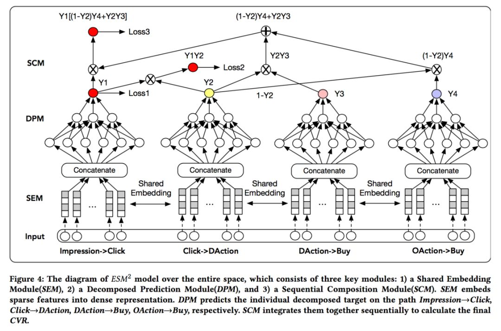

> 本文是推荐算法实战系列第10篇文章。

前面文章包括：

1. 推荐系统简介
2. 特征工程
3. embedding
4. 精排
5. 召回（1）：传统召回以及召回中的loss设计
6. 召回（2）：word2vec召回、FM召回和双塔召回
7. 召回（3）：图卷积
8. 粗排
9. 重排

本文开始介绍多任务与多场景。

自从2018年Google提出**MMOE**之后，多任务与多场景成为大厂推荐算法的标配。

推荐模型涨分的几大法宝无外乎：

- 更贴合业务场景，融入更多先验知识的特征工程
- 更丰富的样本
- 通过多任务引入更多监督信号
- 通过多场景引入更多样本信息并对样本纠偏

多任务与多场景既有共性—有些模型，例如MMOE既可以用在多任务也可以用在多场景—也有差异性。

二者的核心是 **“共性与差异性”的平衡**，更多挖掘不同任务、场景之间的共性实现信息**共享**与知识**迁移**，同时识别差异性避免**拉扯和跷跷板**效应。

本文主要介绍多任务，下一篇介绍多场景。

## 1、多任务推荐的应用场景

多任务建模（muti-task）又称多目标建模（muti-objective）。可以从两个角度来理解：

- 第一，解决“既要又要”的需求。
  - 比如，视频推荐场景下，我们推荐的结果，既想让用户多点击，也想让用户观看的时长更长，还想让用户多评论、多转发等等。因此需要建模点击率、观看时长、评论率、转发率等多个目标。
  - 再比如，电商推荐场景下，推荐的结果既想让用户多点击（引导更多进店pv），也想让用户多下单购买（引导更多成单）。因此需要建模点击率ctr、点击转化率cvr、曝光购买率ctcvr等。
- 第二，解决（正）**样本稀疏**，监督信号不足，实现数据增强。例如，建模最终的曝光转化率ctcvr时，正样本比较稀疏，可以引入一些中间环节的监督信号（例如曝光加购率）作为辅助任务**。

**训练阶段，每个任务对应一个lable，计算一种loss，最后多个loss融合成一个loss，监督模型的所有参数做联合训练。**

预测阶段，每个任务输出一个score，**所有score需要融合成一个score**再排序。

通常，模型网络中所有的参数都会受到所有的loss的反向传播指导梯度更新，如果想对某些子结构的参数筛选梯度更新loss来源，可以通过**stop-gradient**方式实现。

## 2、多任务推荐的误区

- 为什么不对每个目标单独建模

首先，这样做太浪费资源。如果对10个目标用10个模型独立建模，资源消耗和维护成本太高。

其次，用户转化是一个链条。比如先点击，再加入购物车，最后购买。这个链条中，越靠后的环节价值越大，但是正样本越少，单独训练学习不充分。

- 为什么不直接建模最终目标

为什么不直接建模ctcvr，而要建模ctr、cvr等多个目标呢？

一来，如上所述，最终目标ctcvr样本比较稀疏，难以学习充分。

第二，即便用户没有最终转化，也不代表不喜欢推荐结果。优化前面的ctr、cvr环节，有利于提高用户粘性和长期转化。

第三，无论是否转化，用户的每次点击都有价值，在广告定价时，会针对ctr、cvr、ctcvr设计不同的计费模式。

## 3、并发建模

每个目标独立建模，**忽略了不同目标之间的因果关系**。

### 3.1、Share Bottom（Muti-Tower）

最常见的网络结构是“**底层共享+上层tower独立**”的方式。即“**share bottom + multi-tower**”的结构。

- 底层结构，比如embedding层和底层的DNN所有任务共享。
- 上层每个任务有一个自己的独立的塔。接收share bottom的输入，然后经过塔自己的MLP得到自己的logits，根据任务自身的label计算自己的loss。
- (**备注**：虽然上层塔是独立的，但是由于不同loss融合成一个loss后计算梯度，它也会受到其它任务的loss的影响，引起负迁移。可否让上层塔只受自己的loss更新？）

这种方式的优点是通过share bottom结构实现了多任务之间的“知识迁移”。多任务的样本共同训练底层embedding，比单个任务能训练地更充分。

但是，它也存在一些问题：

- 负迁移（Negative Transfer）：A与B联合训练时，A的效果比单独训练A更差，任务B亦如是。
- 跷跷板现象（Seesaw）：联合训练时，任务A的效果比单独训练更好，但是任务B更差了。

主要原因是，不同任务之间共享的部分太多了，很多参数同时应付多个目标，分身乏术。

**解决之道是拆分share bottom**，尽量让不同任务更新不同参数，减少不必要的共享带来的干扰。

### 3.2、MOE与MMOE

沿着分拆“share bottom”的思路，MOE将share bottom分拆成几个小型DNN，俗称expert。**不同expert关注不同的信息**。然后通过一个**Gate**网络，将不同expert的输出**加权求和融合**成一个输出，送入上层不同的tower。

所谓门控网络Gate，通常是一个简单的MLP，它的输出必须**经过Softmax层转化成概率分布的形式**，**输出头的个数与expert的个数一样**，每个head的概率值，表示对应expert的权重。

MMOE在MOE的基础上，给**每个任务增加了一个Gate**，即每个任务有一套自己的多expert融合权重。

Gate的输入既可以和expert一样，是模型的所有输入特征，也可以自己选择有所侧重。

可以统计每个expert在不同task上的权重分布，**比较理想的情况是，每个expert对不同task的权重分布有所差异**，表明不同的expert倾向不同的task。如果发现，每个expert的权重分布相似，说明多个expert没有学习到足够的差异信息，可能有提升空间。

### 3.3、CGC和PLE

腾讯在Recsys2020上提出了PLE结构。它相对于MMOE有两点改进：

- 继续分拆share bottom，将所有expert分成两类，**任务独占task specific**和**任务共享task shared**。前者只参与单一任务，后者参与所有任务。
- MMOE中只有一层expert，PLE引入了**多层expert**，expert之间的交互层层递进。

不同expert层的级联如下：

- 假设总共有N个task。
- 假设第k层有ms个共享expert，建模task-i有mt-i个独占expert。
- 每个task-i的所有独占expert接收同样的输入，来自上一层中建模本任务task-i的mt-i个独占expert和ms个共享expert的输出向量的gate加权和。gate的输出维度是ms+mt。（只包含**共享expert**和**本task的独占expert**，不包含别的task的独占expert。）
- 所有共享expert接收同样的输入，来自上一层所有共享expert的输出，以及所有task的所有独占expert的输出向量的gate加权和。gate的输出维度是所有expert的数量（包含所有**共享expert**，和**所有task的独占expert**）。

## 4、串行建模

串行建模主要用于电商场景。

建模CTR、CTCVR时可以用上述并行建模的方式。但是CVR任务有些特殊。它的训练样本为**点击物料**，线上预测样本为**未曝光样本**，训练数据与预测分布不一致，存在明显的**样本选择偏差SSB**。

### 4.1、ESMM

ESMM解决SSB的思路比较巧妙，主要包括：

- 将CVR任务与ctr、ctcvr一样，**建模在“曝光样本空间”**（理论上，应该建模在粗排结果集上，但是实现起来有困难，约定俗成用曝光样本空间，其中的SSB忽略）。
- 但是，曝光未点击的样本不符合cvr的定义，因此cvr只能作为**隐藏目标**，在其它目标ctr、ctcvr优化的同时被间接优化。

其实现细节如下：

- 模型由CVR模块和CTR模块组成，输入的都是**曝光样本**。（传统cvr模型输入的是点击样本，不包括曝光未点击样本）。
- 模型有两个loss：ctr和ctcvr，且二者均在曝光样本空间上训练，**没有cvr loss**。
- ctr和cvr模块的底层embedding是共享的，有利于正例丰富的ctr任务向正例稀疏的cvr任务知识迁移。
- 两个塔分别得到pCTR和pCVR，根据条件概率，得到曝光购买概率pCTCVR = pCTR * pCVR。
- 由于pCTR和pCTCVR都是建模在“曝光样本空间”上，其label也是在曝光样本空间上，可以直接优化，**而pCVR的label不在曝光样本空间上，因此不能直接优化，只能作为pCTCVR的组成部分被间接优化。** 好处是，pCVR的参数也是在曝光数据训练出来的，消除了SSB。
- 其总损失函数如下：

$$
L(W_{ctr}, W_{cvr}) = \alpha \sum_i^N BCE(y_i, dnn_{ctr}(x_i; W_{ctr})) + \beta \sum_i^N BCE(z_i, dnn_{ctr}(x_i; W_{ctr}) \times dnn_{cvr}(x_i; W_{cvr}))
$$

- xi: 第i条样本的特征
- yi: 第i条样本的点击label
- zi：样本i的购买label

注意，在TF版本的代码中，**虽然都是BCEloss，但是二者实现方式略有不同**，ctr loss拿label和**logits**计算损失，而ctcvr loss没有logits，只能拿label和**概率**计算loss。

```python
ctr_loss = tf.nn.sigmoid_cross_with_logits(labels = ctr_labels, logits = ctr_logits, name='ctr_loss')
ctr_loss = tf.reduce_sum(ctr_loss)

prob_ctcvr = tf.multiply(prob_ctr, prob_cvr)
ctcvr_loss = tf.keras.binary_crossentropy(ctcvr_labels, probs_ctcvr)
```

ESMM的bottom部分也可以采用MMOE结构，上面仍旧保留两个ctr tower和cvr tower即可。

（**备注**：如果线上预测不是为了拿到cvr，而是ctr或者ctcvr，还需要这么分拆吗？直接用两个塔，一个ctr，一个ctcvr联合训练，不需要cvr的中间环节可以吗？）

### 4.2、ESM2

前面提到，**推荐模型涨分的技巧之一，是增加监督信号**。

在ESMM中，CVR任务仍然面临一定的样本稀疏性，因为从点击到购买的样本比较少。

通过挖掘用户行为，发现**用户在购买之前，往往还会有其它的行为，比如加入购物车，或者心愿单，这部分行为数据相较购买数据还是比较多的**。[ESM2](https://arxiv.org/pdf/1910.07099.pdf "alibaba-sigir20-ESM2")继续沿着“**通过条件概率分拆目标**“的方式，**将CVR任务由Click->Buy分拆成Click->DAction/Oaction->Buy，引入了更丰富的中间环节监督信号**。

其中，**DAction**表示加入购物车、心愿单等与**购买强相关**的直接行为。除此以外的其它行为或者无行为称为**Oaction**。二者概率和为1。

其模型结构如下图所示：



ESM2要预测**4个概率**：

- y1：曝光-点击概率。
- y2：点击-直接行为概率。
- y3:   直接行为-购买概率。
- y4：其它行为-购买概率。

模型有**三个label**，要优化三个目标：曝光-点击、曝光-直接行为、曝光-购买，全都在“**曝光样本空间**”。每个目标的预测值基于上述四个概率得到：

- pCTR：impression-click，由第一个网络的输出y1得到。pCTR = y1。其label为是否点击。
- pCTAVR：impression-click-Daction，pCTAVR = y1 * y2，由前两个网络的输出结果相乘得到。其label为是否有直接行为。
- pCTCVR：impression-click-Daction/Oaction-Buy，pCTCVR = y1 * [y2 * y3 + (1-y2) * y4]。其label为是否购买。

对上述三个目标，分别计算交叉熵loss，最后**三个loss加权求和**得到总的loss。

$$
Loss = w_1Loss_1 + w_2Loss_2 + w_3Loss_3
$$

在论文中，ESM2是为了预测CVR，最终线上预测时，CVR=y2 * y3 + (1-y2) * y4。

（**备注**：1. 如果y4很小会不会影响预估效果？2. 如果不是cvr任务，而是ctr或者ctcvr任务还需要这么分拆吗？直接三个塔建模ctr、ctcvr、ctavr三个塔不需要中间的cvr环节可以吗？）

### 4.3 更通用的知识迁移

ESMM可以看做pCTR向pCTCVR迁移知识。

pCTR参与pCTCVR的建模，相当于“**前一个环节向后一个环节注入知识**”，这属于一种更通用的设计模式。

前一个环节本来就与后一个环节存在因果关系，再加上前段环节数据多、预测精度高，前段环节提取的信息能给后段环节更多的提示，帮助后段环节训练好。

从知识迁移的角度，ESMM还有很多可以改进之处：

- CTR任务向CTCVR任务**只传递了pCTR一个实数**，**过于浓缩**，损失了很多细节信息。
- 拘泥于条件概率相乘的形式，迁移方式过于简单。

我们可以采用**更通用、更灵活的方式迁移知识：提取前一个环节隐层输出，输入后段环节，辅助后段环节的训练**。

比如，业务需要预测pCTR、观看时长dwell，转发概率pForward，可以按如下方式建模：

- 底层采用MMOE或者PLE。
- 上层是三个塔，对应三个任务的输出。
- **ctr tower的倒数第二层的输出向量**，提炼、浓缩了用户与当前视频的重要信息，传递给dwell tower和forward tower，作为后者的输入，与其它输入一起喂入上层tower。
- 需要注意的是，**将前段环节输出注入后段环节输入之前，需要先stop gradient，防止后段环节反向传播将训练好的前段环节带偏。**

### 4.4、基于因果推断的纠偏（IPW&DR&ESCM2）

上述ESMM和ESM2是解决CVR样本选择偏差的经典做法，思想巧妙，禁得住实践检验，已经成为通行做法。

此后，阿里分别于2020和2022发表了两篇论文, [causalESMM](https://arxiv.org/abs/1910.09337 "2020-www-alibaba-causalESMM-MultiIPW+MultiDR")和[ESCM2](https://arxiv.org/abs/2204.05125 "2022-sigir-alibaba-escm2")，指出了ESMM的一些缺陷，并将**因果推断**引入推荐系统，解决样本选择偏差。

同样是解决样本选择偏差，它们是两种完全不同的风格。

ESMM直接将CVR的训练过程建模在曝光样本空间，无需任何数学推导，符合直觉，其创新点一句大白话就能讲明白，简单直接。一旦理解了它的关键创新点，会暗暗叫好。

基于因果推断的两篇论文，有大量的数学推导，看似很严谨，实则有“雕花”之嫌，个人不是很喜欢这种风格。这两篇文章都比较难懂。

本轮大模型热爆之前的那几年，因果推断是AI领域最热门的技术之一。图灵奖得主Judea Peal老先生介绍因果科学的科普书《Why》成为了畅销书。他的核心观点是，**基于统计的AI技术（深度学习）只能理解“相关关系”（correlation），无法理解“因果关系”（causation），因而无法实现“强人工智能”**。他提出了一套研究因果关系的工具，包括**因果图**、**do算子**等。

2021年诺贝尔经济学奖授予三位利用因果推断进行定量经济研究的经济学家。此前，我研究过他们撰写的计量经济学文章。从中学习到了一些有意思的思想工具，比如“**工具变量法**”、“**断点回归法**”等。但是最让我触动的是，经济学家想用严谨的数学工具对经济、社会现象做实证分析很困难，其最大的挑战是缺乏高质量的数据。经济学家必须使用很多假设、运用很多思想实验。从这点来看，搞计算机的是很幸福的，我们最不缺的就是数据。

把因果推断和机器学习结合，以及把因果推断用于推荐系统，这几年很火。涌现了一大批论文，和一批开源工具，包括Microsoft的EconML、DoWhy，Uber的CausalML，以及Causal Forest等等。

因果推断的建模方式和思维习惯与机器学习有着**微妙**的区别。很多论文的作者，其实对因果推断没有透彻的理解，只是念经般地叨叨“因果关系不是相关关系”之类的话，然后就拿新技术装点门面。虽然噱头居多，但是不妨碍很多人靠着这个升职加薪。

究其根本，让机器从数据里学习到因果关系是很难的（如果不是完全不可能的话），不可避免地要用到一些假设。Judea的do算子必须依赖因果图。但是**因果图不能只从数据里得到，需要借助人的先验知识和领域信息**。往好了说，因果推断提供了一种框架（因果图），往数据中注入人类的先验信息，从而指导机器获得比纯数据驱动的统计学习更高阶的因果关系；往坏了说，它依赖强假设，无法完全自动端到端地学习。后一点很要命，毕竟搞计算机的很讨厌假设条件，对自动化的端到端系统有一种执念。

这也是为什么直到今天，推荐系统业界主流的做法还是基于统计的ctr、cvr预估模型，因果推断只是在特定场合用来做debias纠偏。

这两篇文章用到的核心因果技术有两个，IPW和DR。下面先做介绍。

#### 4.4.1、IPW（Inverse Propensity Weighted esitimation）

在因果推断领域，**同时影响treatment变量（T）和outcome变量（Y）**的因子称为**confounder**（**混淆因子**，C）。confounder使模型预估T对Y的因果效应有偏。为了准确地预估因果效应，需要剔除（**control**）混淆因子的影响。黄金法则是随机试验（RCT）。但是很多场景下，无法设计随机试验，需要其它的方法。IPW就是其中之一。

IPW的原理如下：

- 观测数据集包含干预组和非干预组，设计模型预估其中每个样本接受treatment干预的概率，记作Propensity。Propensity模型可以选择LR或者其它ML模型，其特征的选择通常遵循以下原则：
  - 同时影响T和Y的特征因该选入。
  - 只影响Y的特征可以选入。
  - 只影响T的特征通常不选入，它们会增加方差variance。
  - 如果混淆因子之间有非线性关系，或者同一个混淆因子与另一个特征交叉时，在不同的交叉分组中有不同的效应，可以设计交叉特征。例如，如果是否患糖尿病对于是否接受干预的影响度在男性患者和女性患者中不一样，那么可以设计“是否患糖尿病-性别”的二元交叉特征。
- 对每个样本按照它接受自己所属干预的概率的倒数加权，即Inverse Propensity Weighting。干预组样本的权重为1/Pronpensity，非干预组样本的权重为1/(1 - Propensity)。(**备注**：干预组和非干预组样本权重不一样，必须包含非干预组样本吗？)
- 加权后相当于生成了一个新的**伪随机样本集**，在这个样本集中，**混淆因子在干预组和非干预组中均匀分布**，即样本是否treatment与混淆因子互相独立，在因果图中打断了C和T之间的连接，剔除了混淆因子的影响。（**备注**：通常，新的样本集大小为原来的两倍，干预组和非干预组的样本数一样，在新的更大的样本集中treatment变成了随机分布，近似于随机试验。）
- 在伪随机随机样本集中，预估T对Y的因果效应。

基于IPW的因果效应预估如下：

$$
E\Big[ Y \frac{T-e(x)}{e(x)(1-e(x))} \Big]
$$

其中：

- x：样本
- Y:  样本x的outcome值
- T:  样本x的treatment值
- e(x): 样本x的Propensity score

当propensity趋近0时，其倒数趋近无穷。为了解决数值稳定性问题，通常有如下方法。

第一，weight stabilization。将分子的1替换为样本集中接受干预的样本的比例（e.g. 正样本的比例）。即干预组中的样本加权概率为：${ \frac{干预组样本比例} {Propensity} }$；非干预组中的样本加权概率为：${\frac{非干预组样本比例}{1-Propensity}}$。这种方式能降低IPW预估的variance。

第二，截断。按照weight分位点分布的1%和99%截断。只保留在此范围内的weight，剔除过大和过小的weight。这种方式也能降低IPW的variance，但是它改变了样本的分布，可能会增加bias。

第三，self-normalized IPW。分子的1替换为所在组的样本的ps得分之和。

PSM模型完成预估后，可以通过数据分析（e.g. box-plot）和统计检验（e.g. Kolmogorov–Smirnov test）验证混淆因子是否在干预组和非干预组中均匀分布。

IPW受ps影响很大，variance很大。

#### 4.4.2、 DR（Doubly Robust estimation）

IPW的缺点是依赖PS模型的准确性。如果ps预估不准确，加权系数不准确，影响最后结果。

为此，提出了DR预估方法：

$$
ATE = \frac{1}{N}\sum\Big( \frac{T_i(Y_i - \hat{\mu_1}(X_i))}{\hat{P}(Xi)} + \hat{\mu_1}(X_i) \Big) - \frac{1}{N}\sum\Big( \frac{(1-T_i)(Y_i-\hat{\mu_0}(X_i))}{1-\hat{P}(X_i)} + \hat{\mu_0}(X_i)\Big)
$$

其中，

- $\hat{\mu_1}(x)$: 干预组样本（T=1）的outcome response model预估的因果效应。
- $\hat{\mu_0}(x)$: 非干预组样本（T=0）的outcome response model预估因果效应。
- $\hat{P}(x)$: ps模型的预估值，即Propensity score。
- 第一部分表示干预组的平均因果效应，第二部分表示非干预组的平均因果效应，二者相减得到平均因果效应。

```python
def doubly_robust(df, X, T, Y):
    ps = LogisticRegression(C=1e6, max_iter=1000).fix(df[X], T).predict_proba(df[X])[:, 1]
    mu0 = LinearRegression(df.query(f"{T} == 0")[X], df.query(f"{T} == 0")[Y]).fit().predict(df[X])
    mu1 = LinearRegression(df.query(f"{T} == 1")[X], df.query(f"{T} == 1")[Y]).fit().predict(df[X])

    ate = np.mean(df[T] * (df[Y] - mu1) / ps + mu1) -  np.mean( (1-df[T]) * (df[Y] - mu0) / (1 - ps) + mu0)
  
    return ate
  
```

DR的优点是，**ps模型和$\mu$模型只要有一个预估准确，结果就是准确的**。

但是问题是，实际情况中，这两个模型都很难100%预估准确。**两个模型都有误差的情况下，DR预估是否比只用单一模型更好，也不一定**。

#### 4.4.3 Multi-IPW和Multi-DR

普通的基于IPW的预估模型（**NaiveIPW**）将原始cvr预估loss乘以样本的ps分的倒数。

$$
\varepsilon^{IPW} = \frac{1}{|D|} \sum_{(u,i) \in D} \frac{o_{u,i}e(r_{u,i}, \hat{r}_{u,i})} {\hat{p}_{u,i}}
$$

（**备注**：loss是在样本空间O还是D上计算？如果是在D上计算，那么unclick样本的loss如何计算，直接当做0吗？因为分子等于0。）

在普通的基于IPW的预估模型中，ps得分由一个独立的模型得到，例如LR模型。它与cvr模型无关。

为了充分利用多任务架构中的参数共享，阿里提出了Multi-IPW模型。**在cvr任务中，样本的ps得分即样本的ctr**。ps模型即ctr模型。因此我们可以把ps模型和cvr模型放在一个MTL多任务框架中，联合训练。

**Multi-IPW**在Naive-IPW的基础上引入ps模型联合训练。

Multi-IPW的loss如下：

$$
\varepsilon^{Multi-IPW}(\chi_{O}; \theta_{ctr}, \theta_{cvr}, \Phi)
= \frac{1}{|D|}\sum_{(u,i) \in D} \frac{ o_{u,i} e(r_{u,i}, \hat{r}_{u,i}({x_{u,i} ; \theta_{cvr}, \Phi})) } {\hat{p}_{u,i}(x_{u,i}; \theta_{ctr}, \Phi)}
$$

其中：

- 分子：cvr任务的loss，通常是交叉熵loss。
- 分母：ctr任务的预估分，作为cvr样本的ps。
- $\Phi$：ctr与cvr任务的共享参数（底层embedding）。
- （**备注**：ctr任务的loss如何体现？ctr任务的loss如何融合？训练的样本空间是D还是O？unclick样本的loss如何处理？）

可以证明，**如果ps模型（ctr）预估100%准确，则cvr任务预估结果无偏**。（**备注**：这里的cvr任务是指纯点击样本空间O中训练出的CVR任务？）

可见，multi-IPW依赖ps模型（ctr模型）的预估准确性。为了缓解这种依赖，提出了DR模型。

DR涉及两个模型：

- 原始预估模型，预估原始打分，其loss为$e_{u,i}=e(r_{u,i}, \hat{r}_{u,i}).$ （**备注**，这里的预估模型是ctr模型还是cvr模型？）
- **imputation模型**，预估上一个模型的的residual，其label为上一个模型的loss，即$e_{u,i}$，预估结果为$\hat{e}_ {u,i}$。其loss为二者之差： $\delta_{u,i} = e_{u,i} - \hat{e}_{u,i}$。
- （**备注**：Imputation在英语中有把A归咎于B，用B替换A的意思。unclick样本上的residual通过预估模型拿不到，退而求其次用Imputation模型的预估值代替，click样本上的residual仍用cvr模型得到。）

其loss表示如下：

$$
\varepsilon^{DR} = \frac{1}{|D|}\sum_{(u,i) \in D} \Big( \hat{e}_{u,i} + \frac{o_{u,i} \delta_{u,i}}{\hat{p}_{u,i} } \Big)
$$

其中：

- 第一项为imputation模型的**预估**结果（**备注**：没有直接使用原始模型的loss，而是其预估值，因为是预估值，故可以定义在曝光样本空间D上。）。
- 第二项为imputation模型的**loss**的逆概率加权。(**备注**：分子中imputation模型的预估值可以发生在unclick样本上，其label值是否能定义在unclick样本上？它依赖于cvr任务的训练样本的输出loss，但是cvr的loss无法定义在unclick样本上？一种Naive-Imputation将unclick样本作为（点击的）负样本。另一种HerristicDR将unclick样本按照概率p设为正样本，1-p设为负样本。)
- （**备注**：训练空间为D还是O？第一项的训练空间为D？第二项虽然分母的空间为D，但是分子由于乘以o，等于unclick样本直接取0？)
- （**备注**：Imputation模型本身的准确性如何保证？imputation loss可否不采用DR这种融合方式，而是作为一个普通的辅助loss，加到原loss上，做联合训练？例如$loss_{cvr} + \lambda loss_{Imp}$）

进一步，引入多任务联合训练。在Multi-IPW基础上引入一个imputation模型，得到Multi-DR模型，其loss如下：

$$
\varepsilon^{Multi-DR}(\chi_O; \theta_{ctr}, \theta_{cvr}, \theta_{Imp}, \Phi)
= \frac{1}{|D|} \sum_{(u,i) \in D} \Big( 
  \hat{e}_{u,i}(x_{u,i}; \theta_{Imp}, \Phi) + 
  \frac{o_{u,i} \delta_{u,i}(x_{u,i}; \theta(cvr), \theta_{Imp}, \Phi)}
  {\hat{p}_{u,i}(x_{u,i}; \theta_{ctr}, \Phi)}
  \Big)
$$

（**备注**：ctr loss和cvr loss还需要吗？如何融合？）

可以证明，**ps模型和imputation模型只要有一个能100%预估准确，则cvr模型的预估结果就是无偏的**。

在论文中，Multi-IPW和Multi-DR是两个模型，它们的的模型架构用一幅图表示：


**Multi-IPW**包括：

- CTR任务：训练空间为D，曝光样本空间。
- CVR任务：训练空间为O，点击样本空间。
- ctr任务的预估分作为cvr任务样本的Propensity score。
- 将cvr任务的loss乘以1/ps，得到IPW loss。
- （**备注**：ctr的loss如何融合？unclick样本如何处理？unclick样本参与计算cvr loss吗？另一种方法是否可行，将CTR和CVR分开训练但是share底层embedding，例如ctr与cvr共用同一份网络结构，先用曝光样本训练ctr模型。再warmup底层embedding参数，重新在点击样本上训练cvr任务，同时在点击样本上预测ctr分，以ctr的倒数加权。）

**Multi-DR**包括：

- CTR任务：同上。
- CVR任务：同上。
- Imputation任务：训练空间为D，曝光样本空间。
- ctr预估分作为cvr样本的ps，参与DR loss的逆概率加权。
- （**备注**：在Multi-DR中是否还需要单独的cvr loss和ctr loss？如果需要，它们之间如何融合？）
- （**备注**：Imputation任务的准确性如何保证，需要单独计算Imputation loss吗？）
- （**备注**：DR和IPW能同时使用吗？）

**效果评估**：

虽然文章是从因果纠偏的角度提出改进措施，但是因果效应本身不好评估，文章仍然采用传统的AUC、GAUC指标。

（**备注**：cvr任务的评估只能在ctcvr样本上进行？）

**无法得到无偏的CVR样本，文章使用的是CTR和CTCVR样本**。具体指标包括：ctr-AUC、ctcvr-auc、ctcvr-GAUC。

待评测模型包括：

- base模型：在点击样本上单任务训练的cvr模型。
- NaiveImputation：引入Imputation loss，将unclick样本当做负样本，（**备注**：Imputation loss作为普通辅助loss，但是不作为DR loss？）
- NaiveIPW：base + IPW，有逆概率加权，无多任务。
- Joint Learning DR：预测模型和Imputation模型按照Joint learning方式训练。（**备注**：Joint learning与多任务训练的区别？）
- Heuristic DR：作为Multi-DR的baseline，unclick样本以概率p作为正样本，1-p作为负样本。
- Multi-IPW
- Multi-DR

离线评估显示：

- Multi-IPW和NaiveIPW都优于base模型。
- Multi-DR通常优于Multi-IPW。
- Multi-DR和Multi-IPW都优于base模型以及非多任务版本的DR模型。

#### 4.4.4 ESCM2

ESCM2与上述Multi-IPW和Multi-DR基本一致。

文章指出ESMM存在两个问题：

- IEB问题：CVR的bias：ESMM的CVR预测比实际值**偏高**。

通常，点击样本上的转化概率比非点击样本的转化概率高。文章证明在此前提下，ESMM在曝光样本集D上的预估值比ground truth偏高。

为此，文章提出**直接在点击样本上训练CVR，然后解决训练过程（点击样本集O）和预测过程（曝光样本集D）之间的样本选择偏差**。

- PIP问题：CTCVR的bias：ESMM的CTR和CVR互相独立，忽视了二者之间的因果性，导致CTCVR任务有偏。（**备注**：这种偏差非常微妙，实际影响有多大？）

实际上，转化只能在点击后发生。从因果图的角度来看，点击（O）与转化（R）之间应该有一条因果边。但是ESMM建模中，cvr和ctr都是建模在曝光样本D上，二者之间是独立的。**ESMM预估的cvr和ctr之间缺乏因果性**。

引入do-calculus后，CTCVR任务可以表示为：

$$
P(o_{u,i} = 1, r_{u,i} = 1) = P(o_{u,i}=1) * P(r_{u,i}=1 | do(o_{u,i} = 1))
$$

- 在点击样本上，上述公式与传统的CVR任务表达的含义一致。差别在unclick样本上（预测阶段）。
- 在非点击样本上，上述公式的含义是：**假如用户点击了这条样本，那么它的转化率是多少** ？这是一个**反事实**问题。

文章证明了，通过给在**点击样本O**上训练的cvr loss增加ps逆概率加权，只要ps概率100%准确，就能够使cvr任务在曝光样本D上预测时保持**无偏**。文章把这种loss处理方式称为IPS正则（Inverse Propensity Score Regularizer）。

由此，通过IPS能同时解决IEB和PIP问题。但是它只在理论上有效，实际使用时，ps概率（ctr预估分）无法100%准确。

文章进一步提出DR方法，来降低对ps准确度的依赖。

为了提高Imputation任务的准确性，文章在传统的DR loss的基础上引入了Imputation loss，文中使用的是MSE loss。

**ESCM2的学习目标**为：

$$
L_{ESCM2} = L_{ctr} + \lambda_c L_{cvr} + \lambda_g L_{ctcvr}
$$

- ctr loss: 训练空间为曝光样本D。文中称为empirical risk minimizer。
- ctcvr loss: 训练空间为曝光样本D。预测值由ctr塔和cvr塔输出相乘得到。文中称为global risk minimizer。（**备注**：前两个和ESMM完全一样？）
- cvr loss: 训练空间为**点击样本O**。文中称为counterfactual risk minimizer。

如果只用 ctr loss和ctcvr loss存在IEB和PIP问题。通过cvr loss解决这俩问题。

cvr loss 有两种实现：

- 基于IPS的实现。在点击样本集O上计算cvr 交叉熵loss，然后乘以ps的倒数。
- 基于DR的实现。
  （**备注**：不能同时使用IPS和DR loss吗？）

网络结构如图-3所示：


注意，ctr塔的输出给到CRM作为ps时，需要**stop-gradient**，以防止带偏ctr塔。

（**备注**：与Multi-IPW以及Multi-DR的差别在哪里？仅在GRM部分吗？但是GRM 在ESMM已经有了）

**效果评估**

文中用到的模型包括：

- Naive MTL: cvr任务在点击样本O上训练，cvr与ctr共享embedding（**备注**：ctr与cvr样本空间不一致，如何融合loss联合训练？cvr任务mask掉unclick样本？）
- MTL-IMP：和Naive一样，只不过unclick样本作为cvr任务的负样本。（**备注**：cvr任务与ctcvr有什么不同？）
- ESMM
- MTL-EIB：unclick样本使用imputed error，click样本使用predicted error（**备注**：如何训练？）。
- MTL-IPS：Multi-IPW。
- MTL-DR：Multi-DR。
- ESCM2-IPS：（**备注**：与Multi-IPW的差别何在？)
- ESCM2-DR：（**备注**：与Multi-DR的差别何在？)

离线评估指标：

- AUC
- KS
- F1&recall

同时评估**cvr和ctcvr**。（**备注**：对于feeds流推荐场景，如果只用一个指标排序，应该用什么，ctcvr吗？)

在cvr任务上：

- ESMM和Naive以及MTL-IMP差不多，甚至比MTL-IMP差一点。文章猜测，**ESMM对cvr任务的提升主要来自多任务架构**。（并不是ESMM文章宣称的样本选择偏差，打脸了属于是。。）
- unbiased版本比biased版本大体上效果更好。
- ESCM2提升明显。
- （**备注**：如何评估cvr任务？是在点击样本上还是曝光样本上？曝光样本的unclick样本没有cvr label，所以应该是在点击样本集上。cvr任务在点击样本和非点击样本上的预估值有何差异？）

在ctcvr任务上：

- 很多工业界场景中，将ctcvr作为主要的排序指标。
- ESMM在ctcvr任务上效果很好。文章认为这是因为它显式建模了ctcvr目标。（有ctcvr loss）。
- ESCM2在ctcvr任务上的**提升幅度没有cvr任务明显**，但是仍然取得了最好的效果。文章认为这是由于引入了ctcvr loss和crm loss。

关于IEB的讨论：

- 计算点击样本集O上的真实转化率，作为在曝光样本集D上的真实转化率的**上界**。
- 统计每个模型在**曝光样本集D**上的cvr预估分的均值。
- 发现，ESMM的cvr预估分**明显高于**根据label计算的转化率，说明**ESMM有高估CVR的倾向**。
- **ESCM2能大幅提高cvr的准度**，降低与真实值的偏离度，说明ESCM2能降低IEB。

关于PIP的讨论：

- PIP认为ESMM模型丢失了点击O与转化R之间的因果关系。
- 我们期望通过计算不同模型在曝光样本集D上预估的ctr分和cvr分之间的因果效应来衡量O与R之间的因果性。
- 由于混淆因子的存在，不能直接通过统计模型（例如皮尔逊相关系数）计算O与R之间的因果效应。
- 可以借助因果推断领域的**PSM**方法剔除混淆因子。
- 将ctr预估分作为Propensity score，cvr预估分作为outcome。
- 将（曝光样本D）按照是否点击分成两组。
- 每一个点击样本，从非点击样本中，找到ps分最匹配的top-K个样本作为它的对照样本（负样本）；由此得到一个新的包含点击样本和非点击样本的样本集。
- 新的样本集中，是否点击是均匀分布的，可以认为不存在同时影响ctr和cvr的混淆因子，可以使用统计模型预估因果效应。
- 通过 **Casual risk ratio（CRR）** 衡量因果效应。
- 通过对比不同模型ctr预估分和cvr预估分之间的CRR值，发现：
- ESMM模型的ctr预估分与cvr预估分基本没有因果性，说明存在PIP问题。
- ESCM2模型的ctr分和cvr分之间有较强的因果性。

关于loss权重的讨论：

- $\lambda _c$: 控制crm loss的强度。当它增大时cvr效果持续变好，ctcvr的效果先升后降。文章认为当它太大时，会影响ctr任务的学习，反过来影响了ctcvr任务的学习。（**备注**：通过stop gradient不能剔除对ctr任务的影响吗？)文章推荐取值范围[0, 0.1]，是一个较小的区间。
- $\lambda_g$: 控制grm loss的强度。当它增大时（0-3之间），ctr和ctcvr效果都稳定变好。

## 5、多个loss的融合

多目标学习时有多个loss，但是**优化器只能优化一个loss**，因此需要通过加权求和的方式将多个loss融合成一个loss。

设置各loss的权重时，主要考虑两点：

- 不同目标的轻重缓急，重要目标的权重大一点。
- 不同损失的数值范围。例如ctr任务的loss是交叉熵，观看时长的loss是MSE，而且时长的label是几十到几百秒，导致时长loss往往比ctr loss大1-2个数量级。简单相加会导致优化器重点优化时长loss忽略了ctr loss。解决方法，一是通过除以常数、开方、求对数等方式压缩时长的数值，二是设置合理的权重，将时长loss压缩到和ctr loss相同量级。

不同权重的调整通常需依靠人工经验，结合线上试验的效果。一边调节权重，一边观察离线、在线指标的效果。收集最后的权重。

阿里2019年提出了基于帕累托最优的半自动化自动搜参算法**PEC**。

其基本步骤为：

- 接收新一批训练数据。
- 计算每个目标的loss的梯度。
- 计算整体loss的梯度，即上一步多个梯度的加权和。
- 按照梯度下降法更新模型参数。
- 利用当前各个loss的梯度，计算出新的权重。
- 重复迭代。

算法的核心是第5步，其基本思想是，**求当前条件下，使得各个梯度加权和最小的权重**。文章按照两步法，构造了一个近似的解析解。

## 6、多个打分的融合

尽管模型会给每个目标都预测一个分数，但是线上排序时只能依靠一个分数。因此，**排序前必须将多目标的多个预估分数融合成一个分数**。

它和loss融合的差异：

- loss融合发生在训练阶段。
- 打分融合发生在线上预估阶段。

打分融合有多种方法。

### 6.1、乘法融合

$$
Score(u,t_i) = \prod_1^K S_k(u, t_i)^{w_k}
$$

- 一次请求中，对每个候选物料，拿到K个目标的预测分数。
- 乘法融合的好处：**特别小的分数连乘后对整体影响很大**，对这些item惩罚较大，能将它们往后排。

### 6.2、加法融合

将上述乘法融合公式取对数，得到加法融分公式：

$$
Score(u,t_i) = \sum_1^K w_k log S_k(u, t_i)
$$

由于对数变换是单调递增的，上述乘法公式和加法公式的排序结果完全等价（对于单一目标？）。

公式中的对数变换可以替换成任何单调递增的函数（例如开方），都不会影响排序结果（？）。因此公式可以写成更一般的形式，其中F是一个单调递增的函数。

$$
Score(u,t_i) = \sum_i^K w_k F(S_k(u,t_i))
$$

### 6.3、rank融合

上述公式中F的选择难点在于，模型给不同目标的打分，天然存在分布差异。例如，cvr的分数普遍比ctcvr的分数高。如果权重设置不好，会导致融合得分偏向cvr而忽略ctcvr。

一种特殊的变换函数F将各目标的打分先变成排名，再取倒数。这种方式彻底忽略了不同目标打分绝对值的差异，只关注物料在同一目标上的相对顺序。

它的问题是有信息损失，在某些目标上打分特别低的物料受到的惩罚不够。

### 6.4、融合权重的选择

目前主流的方法是通过线上试验来选择合适的权重wk：

- 开M组试验，每组试验对应一组权重。
- 观察一段时间后，将效果最差的那组权重用人工挑选的新权重替代。
- 经过一段时间的“调节-观察-再调节-再观察”，选择业务指标最高的那组参数，推全。

上述过程权重的选择依赖人工经验。

目前有些大厂将上述流程自动化，根据上一轮试验自动生成下一轮试验的参数。

**Cross Entropy Method（CEM）** 是一种常用的自动化搜参方法，其核心步骤为：

- 所有K个目标的权重来源于一个K维的正态分布$N(\mu, \theta)$。其中$\mu , \theta$ 都是K维向量。
- 试验开始时，从N中随机抽取M个权重向量。权重向量维度=M * K。第j列代表第j个目标的不同试验组的权重，它们来自一个正态分布$ N(\mu[j], \theta[j] )$。
- 每个向量分配一组小流量线上试验。
- 一段时间后，得到M组业务指标。
- 选取指标最好的前P组权重向量，维度=P * K，将它们沿P轴取平均后**重新生成K维向量$\mu, \theta$。**
- 重新开始下一轮试验，直至效果收敛。

### 6.5、LTR模型

上述权重所有用户共享，**没有个性化**。可以利用LTR模型，对每个用户学习一组个性化的融分权重。

LTR模型的挑战是没有可以直接使用的label。

LTR模型也是一个比较重要的领域，以后有时间再专门介绍。

---
