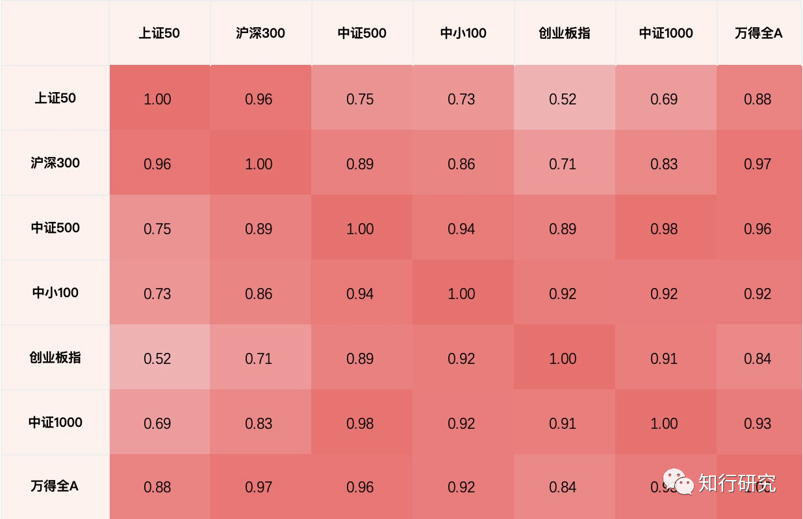
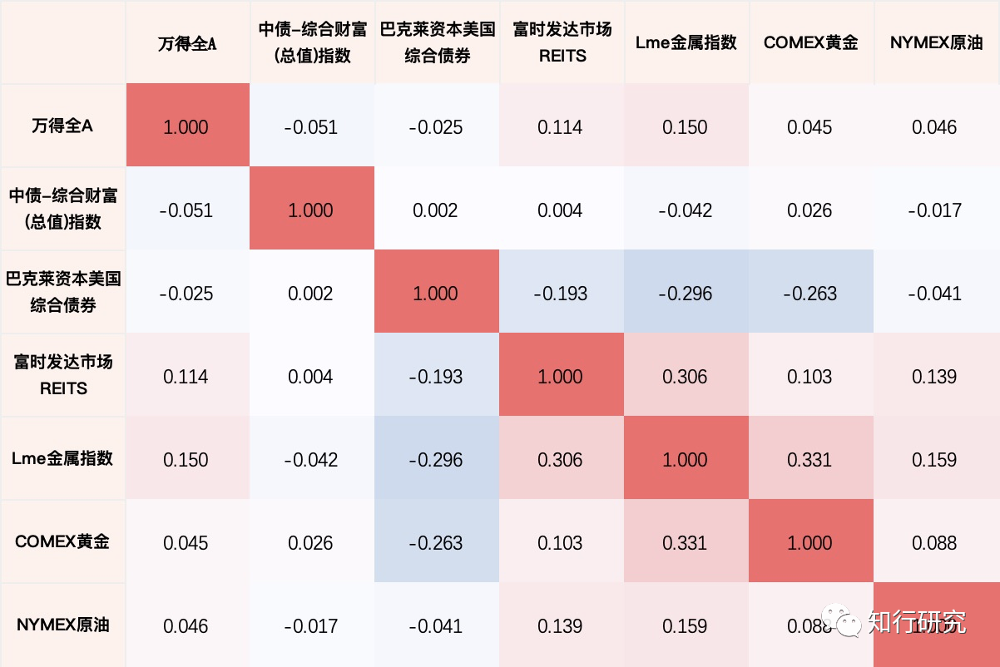

## 1、为什么需要配置债券

**配置债券类资产的目的，是为未来的权益类投资储备子弹，以及分散风险**。

作为打工人，我们的子弹不是无限的，十分珍贵。同时我们的现金流来自于出卖劳动力，需要时间积累。

我们倡导闲钱投资，而闲钱是慢慢积累出来的。

积累闲钱的过程也是储备子弹的过程。

作为散户，我们投研的深度比不上机构和大V，所以必须要求更严格的安全边际。必须耐心等待足够好的机会才出手。这就导致大部分时间，我们可能都是在积累子弹。

一般人，往往账户里有点闲钱就手痒痒。**我们应该给闲钱设定一个安稳的去处**。

存银行定期，赎回不方便，可能错失权益投资机会。

直接放在货币基金，收益率有点低。

投资权益类基金，无论是主动基金还是指数基金，与我们的未来投资标的相关性太强，一荣俱荣，一损俱损。

一个比较好的去处是债券类资产。

首先，债券类资产，通常采用持有到期策略，是一种收息资产，其波动率比较低，风险远远低于股票。

其次，债券的收益率与股票的收益率相关性较低，甚至是负相关。可以尽量避免未来股市大跌出现好的投资机会时债券也大跌而损失子弹。

第三，拉长时间来看，债券的收益率高于货币基金。比货币基金的保值功能更好。

## 2、债券投资的理论基础：资产配置

投资领域有一条铁律，**收益越高风险（波动）越大**。或者说，“风浪越大鱼越贵”。

**资产配置是投资领域唯一的免费的午餐**。它能够**降低波动的同时不损失甚至提高收益**。

这个理论是说，如果能够**找到几只相关性低的资产，构成一个投资组合，定期再平衡，长期而言，能够降低波动，并且不损失收益**。

最常见的应用包括，格雷厄姆提出的“**股债平衡**”策略、瑞达利奥提出的“**全天候策略**”等。

**资产配置的核心是找到低相关性甚至负相关性的资产**。并不是简单增加组合内的品种，就能降低风险。

例如，A股市场的常见指数相关性很高。沪深300和中证500的相关性有0.89，与创业板指也有0.71。在这些指数之间做分散投资，对波动性的降低帮助是有限的。

如果我们把思路打开，看看不同大类资产之间的相关性，则有不同的发现。下图表明，**万得全A与中债综指是负相关的**。正因为债权与股票的收益呈现负相关，它非常适合用来做资产配置。

## 3、债券保本吗：债券投资的基础知识以及风险认知

债券背后是借贷关系。A借一笔钱给B，B给A打一张欠条，约定还本付息的时间和利率。这张欠条就是债券。由于欠条上已经约定了票面利率，票面利率是固定的，所以债券也称**固定收益产品**，即**固收**（fixed income）。

这个名字非常容易让人误以为债券是不会亏损的，其实不然，**债券仍然存在风险**。

债券的风险首先是**违约风险**。例如B哪天跑路了，A的欠条就会变成废纸。违约俗称**暴雷**。

如果债券的期限比较长，在到期日前，债券是可以转让的。A如果当下缺钱，可以把欠条转让给C。转让的价格由当下的市场供需决定。**市场利率是影响债券交易价格的重要因子**。一般来说，市场利率下级，例如央行降息时，债券买盘变多，卖盘偏少，债券价格上升，债券到期收益率下降，债券基金持有的债券净值上升，俗称债市走牛。

债券交易价格的波动，也会影响债券基金的净值，也会带来风险。

债券一般由机构投资者交易，**个人一般只能通过债券基金持有债券**，无法像买入单只股票一样买入单只债券。

就个人投资者而言，当我们讨论债券时，其实是讨论债券基金，**一只债券基金持有一揽子债券**。

债券主要分两类：

- 利率债：借钱主体是政府。国家背书，信用一流，风险低，利息低，收益低。
- 信用债：借钱主体是企业。公司可能倒闭还不上钱，风险更高，收益更大。

利率债又分两种：

- 国债：财政部发行。
- 国开债：国家开发银行发行，用于支持国家重大建设。
- 国开债的收益率比国债略高。

债券的期限越长，风险越高，利率越高，收益越高。一般分为长、中、短三类：

- 长期：例如，7-10年国开债。
- 中期：例如，1-3年国开债。
- 短期：例如，0-1年国开债。

按照是否可以投资股票，债券还可以分为：

- 纯债：不能投资股票，只能投资债券。
- 一级债：历史产物，可以打新股，但是证监会已经叫停了债基打新，所以一级债等同于纯债。
- 二级债：可以在二级市场上买卖股票。由于股票的风险高，二级债必须在基金合同里**约定股票仓位的上限**。一般不超过20%。

能够配置股票的债券，还有一个名字，“**固收+**”。它的含义是，以债券打底（固收），提供低波动性，以股票类资产博取收益弹性。“固收+”的名字很好听，似乎下有保底，上不封顶。但是它有可能只有弹性没有收益。例如，过去几年，由于股市走熊，很多固收+长期负收益，持有体验很不好。

## 4、债券投资的基本原则

债券投资与股权投资不一样。

很多机构投资债券是出于资产配置的需要，并不是为了博取高收益。债券想要获得alpha收益非常难，而且收益弹性很低。债基的收益和它的风险暴露水平高度相关。从这个角度来说，债基排名没有意义。某只债基排名好，很可能是它暴露的风险水位更高，例如它持有的债券期限更久，债券质地更差等等。

债券投资的基本原则是稳健、稳健、还是稳健。

在保住本金的同时，获得债券大盘的平均收益即可。普通投资者，没有必要为了获取一两个点的超额收益，暴露过多的风险。

资产端与负债端的久期要匹配。投入债券组合的钱预期是未来1-3年要用的钱，因为预期未来1-3年我们跟踪的标的可能跌出机会。这种钱，不适合投资超长期的债券，例如国债30。国债30ETF在4月底短短一周下跌了20%。

## 5、构建组合

上面，我们已经明确了债券投资组合的目的，即控制风险追求稳健的同时，获取债券大盘的平均收益，尽量减少风险敞口。

要想降低风险，第一，只选纯债，不选二级债。第二，分散。包括，在利率债和信用债之间分散，主动基金与指数基金之间分散，以及不同久期之间适度分散等。

为此，参考几只投顾分别构建两只债券组合。

组合一：以S计划、长钱计划、简慢计划等投顾中的债基构建组合。

|        基金名称        |  代码  | 类型-1 | 类型-2 | 费率 | 所属投顾 | 配置比例 |
| :--------------------: | :----: | :----: | :----: | :--: | :------: | :------: |
|  广发中债7-10年国开债  | 003376 |  纯债  |  指数  | 0.2 |  S计划  |   20%   |
|    易方达安心债券A    | 110027 | 二级债 |  主动  | 0.9 |  S计划  |   20%   |
|  博时中债1-3年国开行A  | 007147 |  纯债  |  指数  | 0.2 | 简慢计划 |   20%   |
|      富国信用债A      | 000191 |  纯债  |  主动  | 0.6 | 长钱计划 |   20%   |
| 易方达中债1-3年国开行A | 007169 |  纯债  |  指数  | 0.2 | 长钱计划 |   20%   |

组合二：选取稳钱账户的债基构建组合。

|     基金名称     |  代码  |   类型-1   | 类型-2 | 费率 | 配置比例 |
| :---------------: | :----: | :---------: | :----: | :--: | :------: |
|   招商招悦纯债   | 003156 |    纯债    |  主动  | 0.4 |   19%   |
|   兴全稳泰债券   | 003949 | 纯债-信用债 |  主动  | 0.4 |   16%   |
|   华安鼎益债券   | 005709 |    纯债    |  主动  | 0.4 |   15%   |
|    富国信用债    | 000191 |    纯债    |  主动  | 0.4 |   13%   |
|   广发纯债债券   | 270048 | 纯债-信用债 |  主动  | 0.4 |    6%    |
| 交银裕隆纯债债券 | 519782 | 纯债-信用债 |  主动  | 0.4 |    5%    |
| 易方达1-3年国开债 | 007169 |    纯债    |  指数  | 0.2 |   16%   |
| 易方达3-5年国开债 | 007171 |    纯债    |  指数  | 0.2 |   10%   |

## 6、是否需要投资美债

美债的风险特性与中债差别很大，内地投资美债的QDII基金较少，缺乏相应渠道，暂时不考虑。

---

本文总访问量次