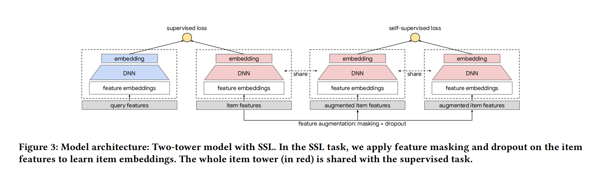

> 本文是推荐算法实战系列第13篇文章。

前面文章包括：

1. 推荐系统简介
2. 特征工程
3. embedding
4. 精排
5. 召回（1）：传统召回以及召回中的loss设计
6. 召回（2）：word2vec召回、FM召回和双塔召回
7. 召回（3）：图卷积
8. 粗排
9. 重排
10. 多任务与多场景（1）
11. 多任务与多场景（2）
12. 冷启动（1）：多臂老虎机

本文继续介绍冷启动。

## 1、对比学习

### 1.1、对比学习的基本原理

对比学习（Contrastive Learning，CL)发源于图像识别领域，是一种**针对少样本的自监督学习算法**。

在少样本学习中，只有少量样本被标注，不足以训练出一个高质量的图片分类器。

CL的解决思路是，把分类任务分成两步，第一步特征编码，第二步分类。**第一步无需标注数据，利用CL自监督学习**；第二步利用已经提取好的特征和标注数据做分类，由于特征已经提取好了，可以**减少对标注样本的依赖，缓解少样本问题**。

在常规ML任务中，特征编码与分类是由一个模型**端到端学习**完成的，由于样本标注稀疏，只好将它们分成两个阶段。

- 特征编码阶段，自监督学习。word2vec、bert、gpt等都是自监督学习。**自监督并不是不要要label，而是无需人工标注，算法自动构建label**。
- 分类阶段，常规的有监督学习。类似于语言模型中的finetune。

CV中的CL过程可以描述如下：

- 有一张原始图片**p**，但是p没有被标注。
- 通过一些技术手段，从原始图片p衍生出多张与其相似的图片 $p_{au}$，这个过程称为“**数据增强**"。图片领域有很多成熟的数据增强算法，例如：黑白化、旋转、镜像、剪裁等。
- 再从全体样本中**随机**抽取一张图片$p_{ra}$，假设样本集足够大，模型无需知道$p_{ra}$的标签，只需知道它与原始图片**不是**同一张图片。
- 将上述三张图片输入特征编码器，得到三者的有效特征向量 $V、V_{au}、V_{ra}$。
- CL任务的**训练目标**为：$V$与$V_{au}$的相似性越大越好，与$V_{ra}$的相似性越小越好。

训练完后得到训练好的encoder，直接用于下一步分类任务中的小样本学习中。

展开说一下，**自监督学习对于LLM的成功非常重要，它是scaling law的基石**。正是由于可以通过自监督学习，源源不断的从语言数据中，自动构建有效的监督信号，自监督学习，LLM模型才能按照scaling law的方式不断提升效果。

视觉模型构建自监督信号比语言模型难的多。因为语言是人类的创造物，它已经经过人脑处理，具有很强的内在结构。而视觉信号来自于大自然，某种程度上，是“上帝的创造物”，更难构建有效的自监督信号以精确提取其中的pattern。

### 1.2、对比学习在推荐系统中的应用

**对比学习的核心是解决样本稀疏问题**。

推荐系统虽然样本量很大，但是仍然存在样本稀疏问题：

- “二八定律"导致20%的热门物料、热门人群贡献了80%的曝光，剩下80%的小众长尾物料、人群缺乏曝光机会，在训练样本中是少数、弱势群体。
- 新用户、新物料贡献的样本少，属于少数群体。
- 某些场景下，正样本比例极低，正样本稀疏问题严重。

样本分布中的贫富悬殊，给模型带来**偏差**（bias）：

- 模型偏心严重，只追求在样本中的多数群体上的表现，对少数群体上的表现熟视无睹，没有动力优化；
- 在用户侧的结果是，模型的推荐结果一味地迎合大众口味，不能让小众用户满意。
- 在物料侧的后果是，小众、新颖物料很少曝光，不利于内容生态的建立。

要解决以上问题，必须放大少数物料、人群在训练样本中的声音，这正是对比学习所擅长的。

简言之，对比学习在推荐系统中的作用主要是**纠偏（debias）**：

在**训练时**，需要注意：

- 对比学习通常以**辅助任务**的形式参与训练，**对主任务纠偏**。
- 参与对比学习的样本，与参与主任务的样本，**最好来自不同的训练空间**。
  - 主任务需要拟合用户与物料之间的真实互动，采用通行做法即可，训练数据以曝光数据为主，以老用户、老物料为主。
  - **对比学习的训练数据应该以鲜有曝光机会的少数人群和小众物料为主**。比如，越少曝光的用户或者物料，其样本被衍生、增强地应该越多；反之则越少。
- 对比学习和主任务之间必须**共享参数**。否则，主模型中的bias仍然存在。
- 上述过程可以描述为：
  - 曝光数据，通过共享的底层embedding和底层MLP，再接入上层的main tower，计算**main loss**。
  - 少数群体增强的数据，通过共享的底层embedding和底层MLP，再接入上层的CL tower，计算**CL loss**。
  - main loss与CL loss融合后梯度回传更新模型。

**预测时，不需要CL tower**，样本经过底层embedding和底层MLP，再经过main tower拿到打分。

### 1.3、对比学习与向量召回的异同

上述对比学习的过程，和之前讲到的向量召回的四个步骤十分相似：

- 第一步，定义**正样本**，对应对比学习的“数据增强"。原样本与其衍生样本相似，构成正样本对。
- 第二步，定义**负样本**，对比学习与向量召回一样，都是**随机采样负样本**。
- 第三步，提取embedding，对应对比学习中，将原始特征压缩成有效特征向量。
- 第四步，设计loss。**召回时，我们不追求每个样本的CTR预估得绝对准确，而是追求把用户喜欢的物料排在前面，不喜欢的排在后面**。这一点与对比学习追求的“**在向量空间里，把原样本与增强样本尽可能靠近，与随机样本尽可能远**”有异曲同工之妙。所以，**向量召回中常用的NCE loss、sampled softmax loss、pairwise loss都可以用于对比学习**。

但是，对比学习仍然与向量召回有一些不同，并不是向量召回改头换面：

- 向量召回属于有监督学习。无论是U2U还是I2I，正样本都来自用户反馈。对比学习属于自监督学习，无需用户标注，正样本完全由我们构造出来。
- 向量召回关注负样本。对比学习的重点和难点在于如何制造正样本。**阅读对比学习的论文，重点是其数据增强方法有何创新，其它方面，比如负样本策略、模型结构、loss设计往往都是向量召回中的常规套路**。
- 向量召回是主任务，对比学习是辅助任务，只存在于训练阶段，不参与线上预测，间接影响模型效果。

### 1.4、纠偏长尾物料的实践：google的CL模型

google于2021年提出的[算法](https://arxiv.org/abs/2007.12865, "google-2021-SSL")，基于**自监督对比学习对双塔模型进行纠偏，提升对长尾物料的效果**。算法遵循经典的对比学习套路。

- 第i个物料$x_i$经过数据增强算法AG和AG'，生成$y_i、y_i'$两个变体。
- 二者都经过物料塔Tower，得到两个向量$z_i、z_i'$。
- 同样的操作应用于另一个物料$x_j$上，得到向量$z_j、z_j'$。
- 对比学习的目标是使得**同一个物料的两个变体的向量越接近越好，不同物料的变体的向量越远越好**。

对比学习的loss就是向量召回中常用的**sampled softmax loss**：

$$
loss_{CL} = Loss_{CL}(z_i, z_i') = -\frac{1}{N} \sum_{i=1}^N log \frac{exp \frac{SIM(z_i, z_i')}{\tau}}{\sum_{j=1}^N exp \frac{z_i, z_j'}{\tau}}
$$

- N：batch大小。
- $\tau$：温度系数，平衡模型的准确性与扩展性。

算法的关键在于设计数据增强函数AG。论文提供了三种方式：

- 随机特征遮蔽：random feature masking。将一个物料的所有特征field随机拆分到两个变体中去。（**备注**：每个变体的特征field不一样，特征长度不一样，如何接入同一个tower？batch的输入特征是完整的所有特征，在batch内，通过mask方法从同一个样本得到不同的变体。）
- 关联特征遮蔽：correlated feature masking。考虑到某些特征field有强相关性，例如国籍和语言，它们应该拆分到同一个变体中。即将强相关联的特征field拆分到一个变体。这样能增强对比学习任务的难度。至于各个特征field之间的关联程度，可以通过人工指定，也可以通过计算“**互信息**”提前准备好。
- 随机丢失：dropout。不再拆分field，而是将一些多值field（e.g. 分类、标签）中的特征值随机拆分到两个变体中。

在样本策略上，主任务的样本与CL任务的样本应该来自不同的分布

- 主任务以曝光样本，老物料为主。
- **CL任务，物料是从所有候选物料中平均抽样产生，小众物料、新物料所占比例大幅提升**。

最后，CL任务与主任务一起训练，底层embedding和物料塔共享。

### 1.5、纠偏小众用户的实践

不同用户群体的用户行为序列存在偏差：

- 大众用户比较活跃，行为**序列长**。大众用户贡献的样本多，模型对长序列提取比兴趣较熟悉。
- 小众用户活跃度差，行为**序列短**，贡献的样本比较少，模型不擅长从中提取用户兴趣。

可以利用对比学习缓解以上偏差。核心是设计**针对用户行为序列的数据增强**。

传统的数据增强方法包括：

- Mask：随机删除原序列中的一些元素。
- Crop：截断，删除原序列中的某些子序列。与mask的差别是，删除和保留的都是连续的子序列。
- reorder：打散。随机找到一个子序列，打乱顺序。

以上方法，在短序列上有一定难度。截断后，原本很短的序列更是雪上加霜，增加模型学习难度。有[文章](https://github.com/YChen1993/CoSeRec, "2022-contrastive SSL rec")提出了对**短序列友好**的增强方法：

- substitute：代替。在原行为序列中随机找到一个物料，用与之相似的另一个物料代替。
- insert：插入。在原行为序列中随机找到一个物料，在它的前面或者后面，随机插入一个与之相似的物料。

可以用多种方法找到相似物料。例如用Item2Vec学习物料embedding，然后用近邻搜索找到相似物料。

除此之外，技术细节与纠偏小众物料类似。算法流程如下所示：

> while not done do
>
>> given a batch of N samples.
>> for i = 1, .. N do
>>
>>> // xi:第i个用户，|xi|:第i用户的序列长度。
>>> if |xi| <= K then // K: 超参数，用于判断历史行为序列是否过短。
>>>
>>>> //对于短序列，增强方法只能从Substitute和insert两种方法种选择。
>>>> sample augment function AG and AG' from { Insert, Substitute}
>>>>
>>>
>>> else:
>>>
>>>> sample augment function AG and AG' from {Insert, Substitute, Mask, Crop, Reorder}
>>>>
>>>
>>> end if
>>> // 应用数据增强函数，得到原用户的两个变体。
>>> yi = AG(xi)
>>> yi' = AG'(xi)
>>> // 得到三个用户向量。
>>> // UserTower：提取用户embedding的网络结构。
>>> $z_i^*$ = UserTower(xi) //原始用户序列得到的用户向量
>>> zi = UserTower(yi) // 根据变体yi得到的用户向量
>>> zi' = UserTower(yi') //根据变体yi'得到的用户向量
>>> // 在第i个样本上计算loss
>>> $loss_i^{main} = Loss_{main}(z_i^*)$ //原始loss。
>>> $loss_i^{CL} = Loss_{CL}(z_i, z_i')$ //对比学习辅助loss
>>>
>>
>> end for
>> $loss_{total} = \frac{1}{N}\sum_i^Nloss_i^{main} + \frac{1}{N}\sum_i^Nloss_i^{CL}$ //总损失。
>> minimize $loss_{total}$
>>
>
> end while

## 2、其它方法

### 2.1、迁移学习

在老场景下，用户embedding学习比较充分，新场景下，用户行为稀疏，学习困难。此时可以考虑迁移学习。用老场景的信息辅助新场景的建模。

一种简单的做法是，**拿老场景学习的用户embedding，作为特征接入新场景**：

$$
\begin {aligned}
 E_u^O &= UserTower(F_u^O) \\
 CTR^N &= DNN(Mapper(E_u^O), F_{other}^N)
\end {aligned}
$$

- O: 老场景。
- N：新场景。
- $E_u^O$: 老场景学习的用户向量

上述老场景的用户向量接入新场景时，需要stop gradient，即知识迁移是单向的。

当新场景发展成熟时，知识迁移可以变成双向的，即多场景建模。

### 2.2、预测物料消费指标

推荐系统中，物料侧最重要的特征是各种**后验消费指标**。

新物料缺乏相应的消费指标。导致新物料受到模型的歧视，排名靠后。

有经验的编辑看到新的文章物料时，很容易判断它能否火起来。我们可以借鉴这一思路，训练一个模型，预测新物料的消费指标。

- 特征：选取**不包括用户反馈信息**的所有物料特征，例如，作者、粉丝数、视频长度、清晰度、分类、标签、画像等。
- 标签：后验消费指标。
- 样本：老物料的样本积累了丰富的消费指标，可以作为样本。
- 模型：由于消费指标是实数值，模型是**回归模型**，loss可以采用MSE等回归loss。
- 使用：模型不直接用于线上推荐。新物料入库时，调用模型，预估消费指标。在冷启动阶段，用预估指标代替消费指标。待冷启动结束，消费指标足够置信时，可以用实际计算的消费指标代替预估的指标。

### 2.3、以群体代替个体

个体的行为稀疏，可以将个体泛化成群体，以群体信息辅助个体推荐。例如[AirBnb的做法](https://dl.acm.org/doi/10.1145/3219819.3219885, "2018-airbnb")。

在AirBnb的房屋推荐场景中，大多数用户与房屋都没有预定记录，属于新用户与新物料。他们的embedding都缺乏足够的训练数据。AirBnb的办法是“泛化”，**用群体embedding代替个体embedding**。

- 根据人工规则将用户与房屋分类。例如，“20-30岁，使用英语，平均评价4.5星，平均消费每晚50元、男性”可以作为一类用户。“一床一卫、接纳两人、平均评价五星、平均收费60美元”可以作为一类房屋。虽然，**单个用户与单个房屋的预定记录非常稀疏，但是一类用户与一类房屋的预定记录非常丰富**。足够学习出高质量的用户类别、房屋类别的embedding。
- 利用类似word2vec的方法，将所有用户类型、所有房屋类型的embedding学习出来。
- 线上推荐时，先将用户泛化成所属类型，再拿这个用户类型的embedding做近邻搜索，得到与其最匹配的房屋类型，作为推荐结果。

### 2.4、借鉴多场景

当把新老用户、新老物料混杂在一个模型中推荐时，存在很多问题。老用户、老物料的样本占多数，主导了模型的训练。模型会迎合老用户的推荐逻辑。此时，增加对新用户重要的特征入不了模型的法眼。**新用户样本有限，即便预测错了，对模型的损失影响有限**。

我们可以尝试新老用户分家。但是，新用户的样本太少，完全另起炉灶难以训练充分。可以借鉴多场景建模的思路来解决这种“**分与合**”的问题。

**将新老用户看成两个场景**。借鉴多场景的技术，提升模型对新用户的重视程度。具体而言，可以**将“是否新用户”特征，作为场景指示特征**。

- 将“是否新用户”的特征，加到离输出比较近的位置，发挥更直接的影响。
- 将“是否新用户”的特征当裁判，动态调节其它输入特征的权重。使模型在面对新用户时，放大对新用户友好的特征。

---

本文总访问量次