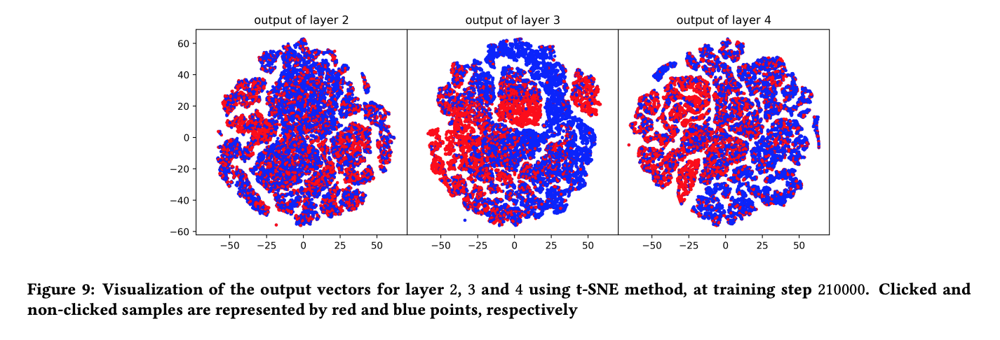

> 本文是推荐算法实战系列第14篇文章。

前面文章包括：

1. 推荐系统简介
2. 特征工程
3. embedding
4. 精排
5. 召回（1）：传统召回以及召回中的loss设计
6. 召回（2）：word2vec召回、FM召回和双塔召回
7. 召回（3）：图卷积
8. 粗排
9. 重排
10. 多任务与多场景（1）
11. 多任务与多场景（2）
12. 冷启动（1）：多臂老虎机
13. 冷启动（2）：对比学习

本文介绍评估与调试。

## 1、离线评估

### 1.1、评估排序算法

#### 1.1.1、AUC

评估排序模型最重要的指标是AUC。二分类算法的输出是一个概率值，通过阈值判断是正例还是负例。给定一个阈值，可以计算False Positive Rate，作为横轴，True Positive Rate，作为纵轴。改变阈值，得到一条曲线，曲线下的面积就是AUC。

一个更直观的解释是**正负样本相对顺序排序正确的概率**。即按照模型输出分降序排列，**正样本在负样本前面的概率就是AUC**。

$$
AUC = \frac{correctly \space ordered \space pairs}{total \space pairs}
$$

AUC衡量模型的**全局排序能力**。

但是**推荐排序是在用户粒度**，只需要考虑对同一个用户候选集的排序能力，不涉及到给不同用户排序。用AUC衡量推荐系统的排序存在失真。

为此，业界提出了**GAUC**，即groupwise AUC。**先计算每个group的AUC，再加权得到整体的AUC**。由于推荐排序是对一次请求的结果而言，理论上，应该以一次请求作为group。但是这样统计出来的一个group的样本太少，所以通常以用户为粒度划分group。

$$
GAUC = \frac{\sum_u w_u AUC_u}{\sum_u w_u} = \frac{\sum_u n_u AUC_u}{\sum_u n_u}
$$

- $AUC_u$：单个用户的AUC
- $w_u$:单个用户的权重。可以每个用户权重一样，即取平均；也可以按照用户活跃度，例如用户曝光pv当做权重。
- 有些情况，可以将权重调整为用户的gmv，这样能让排序模型重点关注高价值用户群体。
- 对于数值型目标，例如观看时长等，可以将其转化为二分类指标，例如完播率。

#### 1.1.2、NDCG

**AUC只考虑正负样本的逆序对，不考虑样本在序列中的位置**。

在推荐场景下，前面位置的样本用户更容易交互，对结果的影响更大。即**前面的样本，排序错误惩罚应该更大**。

为此，业界提出了DCG（Discounted Cumulative Gain），综合考虑每个位置的物料能带来的收益和该位置的折扣效应。

$$
DCG@K = \sum_{k=1}^K \frac{2^{c_k} - 1}{log_2k + 1}
$$

- K：排序结果长度
- $c_k$：第k个位置上物料的贡献。如果未点击，则ck=0；如果点击了，则是观看时长、销售金额等的函数（线性、开方、对数等）
- 从分母可以看出，越靠后的位置，折扣越大，即越靠前的位置对结果贡献越大。

DCG不好直接比较，一个方法是归一化。我们定义IDCG（Idea DCG），即理想情况下，贡献最大的物料排在最前面，得到的DCG的最大值。以IDCG做归一化，得到NDGC

$$
NDCG@K = \frac{DCG@K}{IDCG@K}
$$

将多个排序结果的NDCG取平均，就能得到整个排序模型的性能。

（**备注**：为什么实践中，推荐系统里，NDCG不及AUC、GAUC普遍？）

### 1.2、评估召回算法

#### 1.2.1、AUC不适合用来评估召回算法。

- 召回模型的负样本不好定义。比如，召回模型返回了物料A、B、C，只有C被点击。A和B之所以没有被点击，可能是因为它们被粗排或精排干掉了，没有曝光，并不是用户不喜欢它们。
- **召回本质不是排序**，而是在海量候选集中找到**相关**的样本。即便A和B没有点击，只要C能够被正常召回，也是有意义的，至于排序，留给精排就可以了。

所以，评估召回算法通常不用AUC这类强调排序性能的指标，也避免统计负样本，而是从预测正样本与真实正样本之间的“命中率”、“覆盖度”出发。

#### 1.2.2、precision & recall

以评估双塔召回模型为例，评估样本如下：

$$
TestSamples={<u_i, T_i^{expose}, T_i^{click}> | i \in [1, 2, ... N]}
$$

- 一条评估样本表示一次请求及其结果。
- 一共N次请求。
- ui：第i次请求的发起用户。
- $T_i^{expose}$：第i次请求的结果，曝光集合。
- $T_i^{click}$：第i次请求的结果，最终被用户点击的集合（真实正样本）。

接下来，需要计算precision和recall：

- 对于每次请求，根据用户i计算其用户向量，然后**通过k近邻查找**，得到其top-K的召回物料，作为**预测结果**。
- $Precision@K$：平均下来，每次召回的物料中，真正被用户喜欢的比例。即上一步预测结果中，有多少是真正被用户点击的。
- $Recall@K$：平均下来，用户真正喜欢的物料中，有多少能被模型召回。即在上一步预测结果中，用户真正点击过的物料，有多少被模型召回了。
- 对于召回模型，曝光物料也可以算作正样本，上述指标可以在曝光样本和点击样本都计算出来，相互参考。

#### 1.2.3、MAP

Precision和Recall是一对此消彼长的指标。采用单一K值下的Precision和recall衡量模型效果可能一叶障目。

假设召回物料按照与用户的相关度降序排列，取前i个作为召回结果，将不同i下的Precision、recall连接成一条曲线，横轴为recall，纵轴为precision。然后计算这个曲线下的面积，记作average Precision（AP）。

要最大化AP，就是在**相同的recall下，Precision更高**。

AP综合考虑了不同召回数量的影响，以及Precision和recall两方面的影响（**备注**：哪里体现recall？）

对于单一一次召回结果，AP计算如下：

$$
AP@K = \frac{\sum_{j=1}^K Precision@j \times IsPositive@j}{TotalPositives}
$$

- K：一次推荐请求，模型返回的最大召回数目。
- 分母：历史样本日志中，本次请求下，用户喜欢的物料的数目，即真实正样本的个数。
- 分子中的第一项：前j个召回结果的Precision。
- 分子中的第二项：第j个召回结果是否用户喜欢，喜欢为1，不喜欢为0，避免重复计算。
- 多次召回结果的AP取平均，就得到了MAP，Mean average Precision。

#### 1.2.4、Hit Rate

一条评估样本的单位由一次请求，缩小到一条点击样本。

Hitrate表示，在这N条点击样本（真实正样本，用户喜欢的样本）中，有多少个物料ti是能够被模型给ui的召回结果覆盖的。

（**备注**：含义与召回类似，差别是什么？）

### 1.3、人工评测

上述离线指标是定量方法。不要忽视对结果进行人工评测。

人工评测需要借助工具。

例如，对于视频推荐召回，可以开发一个小程序，输入一个用户，左侧一列结果展示用户最近观看的视频的标题，右侧一列展示召回的结果。从这两列中，可以看出很多问题：

- 右侧召回结果是否符合左侧用户兴趣？
- 假设左侧历史兴趣反映用户有N个爱好，右侧召回能覆盖几个？
- 不同用户的右侧结果，是否足够个性化？同质化是否严重？

AirBnb也开发过类似工具，评估I2I召回结果：

- 输入房屋ID
- 下边展示该房屋的封面与介绍
- 右边列出召回的结果
- 人工评测召回结果是否合理

### 2、在线评估：A/B试验

### 2.1、线上：流量划分

流量划分遵循两个原则：

- 随机性：一个用户划分到实验组还是对照组是完全随机的。
- 确定性：同一个用户的分组是确定的，这样才能保证用户体验连续一致。通常，在财年或者季度结束，rehash，重新打乱一次用户与分桶的映射关系。

#### 2.1.1、根据userid划分流量

一种简单的流量划分方式如下：

$$
bucket = HASH(UserId) \% N
$$

- N：用户分桶数。
- Hash：哈希函数。

这种方式的问题在于，一个用户每次只能分到一个桶，同时只能进行一次试验。对流量的利用效率低。线上同时跑少数几个试验就把流量占满了，无法进行其它试验。

为了解决这个问题，Google提出了分层试验机制。

#### 2.1.2、分层试验

分层试验的核心思想是：

- 假设一共要进行N类试验，将流量分成N层，每类试验独占一层。
- 同一层试验的各个实验组，流量**互斥**。一个用户的请求，在同一层中只能命中一个实验组。
- 不同层的试验是**重叠**的，一个用户的请求，在多层试验中，命中多个实验组。

其实现方式如下：

$$
bucket = HASH(Concat(LayerId, UserId)) \% N
$$

- 与上一节的差别是增加了LayerId。它是层的唯一标识。
- 如何划分Layer？Layer是一个虚拟概念。并不对应推荐系统重的具体的层次关系。
- 如果流量足够，可以把召回、精排、重排分别设置不同的流量层。
- 如果流量不足，试验很多，也可以召回分成多个Layer。只要明白不同Layer的流量正交即可。

### 2.2、线下：统计分析

当我们试验做完发现AB结果新模型的效果指标优于老模型，是否就能说明新模型一定好于老模型呢？即AB结果是否统计置信呢？

这就涉及到假设检验。刚好最近看了一些统计相关的视频和书籍，以后有时间再展开写一写。

假设检验的原理可以解释为**概率反证法**。先构造原假设H0，然后计算原假设成立时，观察结果出现的概率，即p值。如果这个概率非常小，例如小于人为规定的**显著水平$\alpha$**，则认为这是个**极端小概率事件**。小概率事件“通常"不会发生，现在观察到它竟然发生了，那么很有可能是我们的原假设错误，即**拒绝**原假设。

对AB结果进行假设检验的常见方式为：

$$
H_0: \mu_e = \mu_c \\
H_1: \mu_e \neq \mu_c
$$

- H0：原假设。
- H1：备择假设。

根据AB试验收集到的指标，可以构造统计量，进而计算p值。根据p值决定是否拒绝H0。

- 如果p值小于显著水平，则可以拒绝H0。此时，可以接受H1。
- 如果p值大于显著水平，则不能拒绝H0。那么问题来了，**不拒绝H0，是否意味着接受H0呢**？即两组试验没有显著差异？这里有争论。一种观点认为，不能拒绝H0说明试验数据和H0不矛盾，那么我们可以先接受H0。另一种观点认为，p过大，说明没有得到统计显著的结论。根据《女士品茶》一书中的观点，统计大佬Fisher持此立场。我个人觉得，p值过大，可能是试验不显著，也可能是样本不够，此时不妨继续观察几天。

## 3、打开模型的黑盒

### 3.1、外部观察

可以对模型增加多维度监控，方便我们排查问题。

- 输入样本数量，以及各个目标的正负比例；
- **各个特征对样本的覆盖情况**；
- 模型预估结果和真实后验指标（CTR、CVR）的差异；
- 召回结果中各路召回所占比例，最终展示给用户的结果中各路召回所占比例；
- 不同人群、不同展示位置的指标差异；

### 3.2、内部剖析

#### 3.2.1、特征重要性

特征重要性可以帮助优化：

- 对于那些重要的特征，我们可以进一步精细化。比如去除噪音，衍生更多相似特征等。
- 如果按常识应该发挥重要作用的特征，却被模型忽视，那我们应该排查该特征的生成、处理是否出现了错误。
- 不重要的特征，可以从模型删除。

线性模型和树模型中，模型训练完毕，自动得到特征重要性。

DNN模型有多种方法：

- Ablation test

每次删除一个特征，重新训练，得到评估指标，与原模型的评估指标之间的gap，即为该特征的重要性度量。

这种方法，每次只能评估一个特征，费时费力。

- Permutation test

原始模型训练完成后保持不变。测试集中特征f所在的那列数据随机打散（shuffle），得到新的测试集，在新测试集上评估指标与原测试集的gap记作该特征的重要性度量。

这种方法无需每次重新训练模型。问题在于，有些特征是相互关联的，只shuffle其中一列，可能产生不符合常识的样本。

- **Top-Bottom analysis**

原模型训练完成后，喂入测试集打分。将测试集中的样本，按照预估分由高到低排列。取top-N条样本与bottom-N条样本分析。**观察相同特征或者特征组合在头部样本与尾部样本上的分布差异**，差异越大，说明该特征越重要。

- 解释模型法

某些特殊的网络结构，例如SENet、LHUC，对于每个样本，能够计算出每个特征的重要性。

前面三种方法只能计算数据集上整体的特征重要性，第四种方法，能够计算**样本粒度的特征重要性**。例如，同样是userid embedding，老用户和新用户的特征重要性是不一样的。

聚合样本粒度的特征重要性就能够得到数据集上的整体特征重要性。

这种方法用在COLD算法中，简化精排模型的特征作为粗排的的输入。

#### 3.2.2、模块作用

基于DNN的算法模型，通常有很多不同的网络单元。其中哪些模块起作用，哪些是滥竽充数甚至帮倒忙的？

[文献](https://arxiv.org/pdf/1806.08541 "2018-sigir-alibaba-visuallize CTR")介绍了两种方法判断各模块的作用。

目的是检查一个四层DNN中各个全连接层的作用。

将N条样本喂入模型，收集各层输出向量。

第一种方法，可视化。

将每层输出的N个向量，利用**t-SNE算法降维**至2维空间，再画成散点图，如图所示，其中每个点代表一个样本，红色代表正样本，蓝色代表负样本。

- 第三层的输出相比第二层，同一个label的样本点分布更集中，正负样本间隔更明显，说明第三层FC起到了提炼信息的作用。
- 第四层的输出相比第三层，正负样本的间隔更加模糊，说明该层损害了模型的区分能力，可以考虑删除。

第二种方法，LR模型。

利用每层输出的N个向量，拟合一个LR模型，然后比较各层输出拟合的LR模型的效果。效果越好，说明该层输出向量信息越多，越有用。这里选择LR模型是为了让模型的性能差异主要体现在输入特征上，而不是模型本身的拟合能力。

## 4、线下指标涨了，线上没效果

### 4.1、特征穿越

模型训练时，用到的特征包含了label之后的信息，这种现象叫做“特征穿越”。这种情况，离线评估指标偏高。
解决办法是，“特征快照”。模型线上打分时，将所有的特征值记录下来，离线不用计算特征，只需要与label做拼接。这样能够避免特征穿越，也能够保证线上线下一致性。

### 4.2、老汤模型

当线上模型采用在线学习，持续更新时，在长期的线上训练中，积累了非常多的训练数据，见多识广，新模型训练数据没有老模型那么多，很难打败老模型。这种现象叫做“老汤模型"。

一种缓解方法是**热启训练**（warmup）。新模型在老模型的基础上热启训练，将老模型的参数copy过来作为新模型的初始值。

热启时，如果同一个特征或者网络参数在老模型和新模型中维度不一致，需要特殊处理。

- 当维度一样时，直接将老模型的参数值拿来作为新模型特征embedding或者tensor的初始值。
- 如果新模型向量长度更大，在老模型向量值基础上补一段随机向量，作为新模型的初始值。
- 如果新模型向量长度更小，将老模型向量截短，只保留对应长度的向量值作为初始值。

这种方式缺点也不少：

- 新老模型之间的映射比较麻烦，必须严格按照tensor名字和维度匹配。
- 束缚了算法工程师的手脚。当模型结构改动较大时，很多地方不能热启。
- 缺乏理论保证。当tensor尺寸不匹配时，如何截断、补齐，没有理论依据。

### 4.3、冰山现象

如果把精排待打分的全量样本看做是一座冰山，水面之上的样本是曝光样本，通常由老模型产生，水面下的是未曝光样本。

精排模型训练和评测使用的都是曝光样本，即水面上的部分，水面之下的部分没有喂入新模型。

新模型离线效果好只能说明在水面上的样本表现好，在水面下的样本上表现未知，上线后容易翻车。

### 4.4、链路一致性

离线评测时使用的是用户真实反馈样本。

线上预测时使用的是链路中上一个环节的输出样本。而且该模型的输出，还要经过下游模型的进一步调整，**真正影响线上结果的是整个链路的表现**。

**如果本模型的修改不符合下游模型的口味，被下游模型忽视了，最终上线后不会产生效果**。

例如，召回时增加了一路”封面召回"，给用户返回与他之前点击的视频拥有类似封面的视频。但是由于粗排和精排都没有使用封面相关的信息，这一路召回的结果最终可能被粗、精排干掉。

**解决办法是让模型不仅拟合用户的兴趣爱好，还要尽可能迎合下游模型的口味**。

例如在粗排模型中，可以从下游精排的输出中抽样一部分未曝光样本，构建learning to rank任务，辅助粗排模型训练，增强粗排、精排一致性。

---
