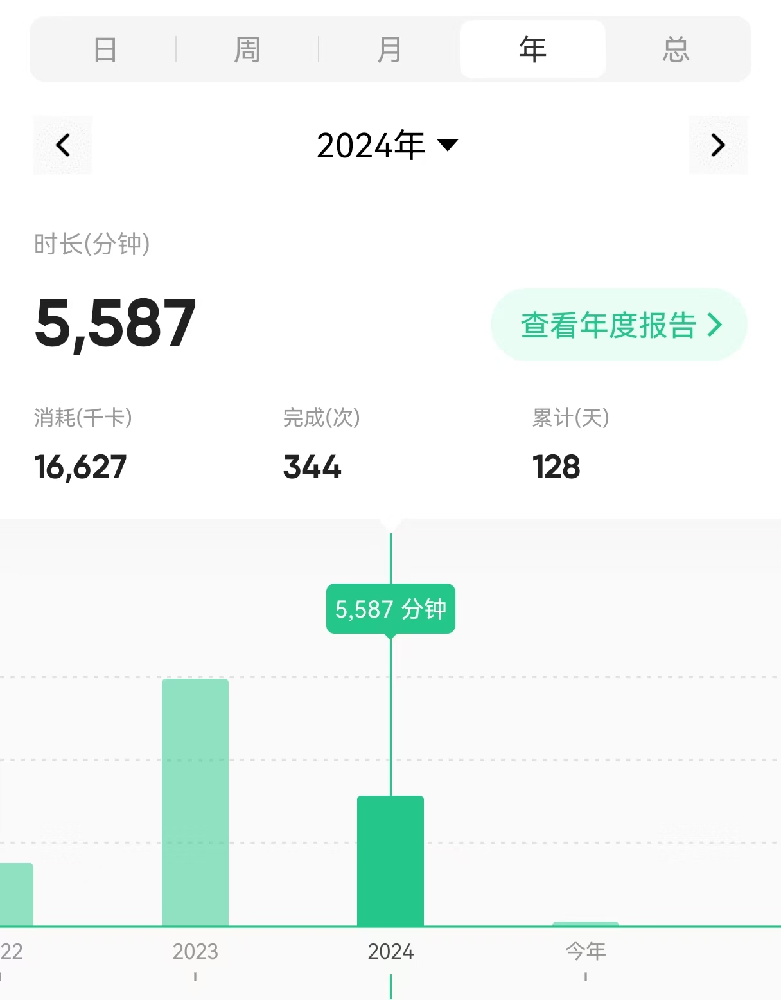
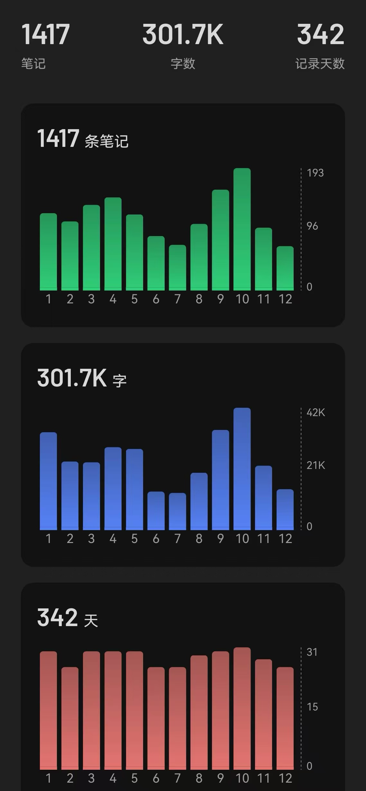
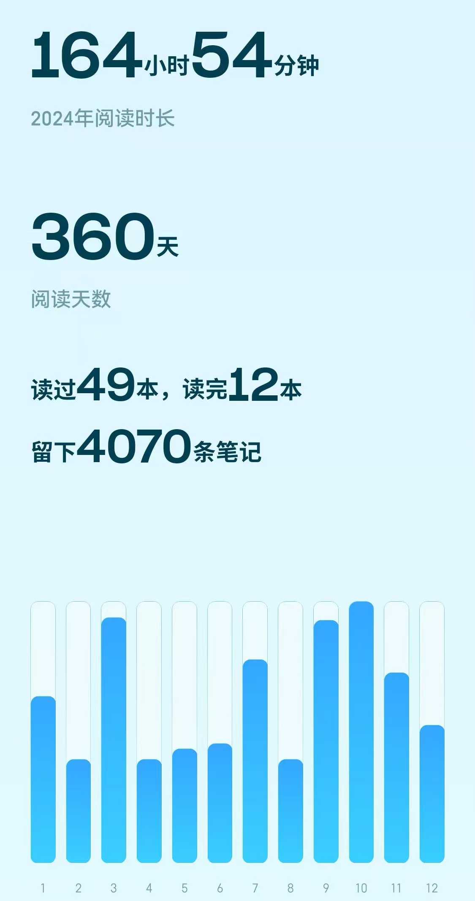

时间过得真快，转眼已经到了三月，终于能抽出一点时间补一下2024年的年终总结。

之所以很长时间没更新，是因为去年下半年遇到了很多事。

人对于那些给自己带来极端重压和不确定性的事情和境遇是不愿意多写的。

有什么好写的呢？给别人做心理按摩是容易的，给自己做心理按摩是困难的。

有那么一些时刻，任何文字和言语的力量都是羸弱和虚浮的，只是凭着每天的惯性，在现实生活中，一日一日地度过。

在那些最晦暗的日子里，任何其它人的境遇，任何思想、信念，都无法替自己做出抉择，无法代替自己承担那些压力和不确定性。

归根结底，人生无常，好运歹运，想太多没用，只能靠自己和家人去实实在在地面对。

如果真的有什么经验可以跟分享的话，那就是一定一定要重视自己和家人的健康。

道理都懂，但是文字的力量，终究有限，没有亲身经历过，是很难体会的。

最有力量的人生教育是医院和病房。最好的人生策略是健康长寿。

不用说，当今世界进入百年未有之大变局，AI的崛起，技术的革命，社会思潮的变迁，活得久才能经历的多；

不用说，对于价值投资的信徒而言，时间是复利的必要条件，活得久，雪球才能滚得大；

不用说，在AI发展日新月异的时代，普通人的内卷无法对抗技术的洪流，不如照顾自己，安顿自己，既坦然面对技术的冲击也好好享受新技术的红利；

不需要讲任何大道理，只是到病房里呆几天，现实世界给人的冲击是任何文字比拟不了的。

新的一年，希望每位朋友身体健康，诸事顺心。

## 1、运动与健康

先分享几次看病就医经历。

第一次，北京中医医院脾胃科，谢静医生。

原因是脚底发沉，脚后跟疼。小毛病，但是不得劲，如果去找西医，可能拍个片子就打发了，查不出来什么问题。看到xhs上中医调理脾胃很多，就挂了个号。挂的是普通号。没想到吃了三天就好了很多，比较神奇，至今仍然存疑，中医真的效果这么好吗？

后面，就想继续调理一下脾胃，挂了副主任医师李帷大夫的号，他是知名中医李乾构的徒弟，周六有号，比较方便。连续看了几次，不知是否心理因素，感觉效果没有第一次好。李医生说至少要调理两个月。后面因为有其他事情，没有坚持。

第三次，西苑医院脾胃科赵一丁主任，特意开了xhs上的网红药膏酸枣仁。这次就医体验非常不好。我刚坐下来还没有说完，他就噼里啪啦开方子。没有仔细问病情，没有仔细辩证。开了一堆的西药和中药。酸枣仁调理睡眠，还不如运动来的直接。身体足够疲惫，自然倒头就睡。

总的而言，如今亚健康的病症越来越多，中医的整体观和调理养生理念比西医更合适，但是好的中医看缘分。大部分亚健康症状都是生活方式引起的。

无论是西医还是中医，个人是健康的第一责任人，锻炼和良好的生活习惯都是至关重要的。

去年还有一次很离奇的经历。

那天北京下大雨，我的车出问题了。那几天，正在读陈行甲的《在峡江的转弯处》，读到他抑郁症的经历，以及他和抑郁症病友的故事。不知道这些与后面晚上的失眠是否有关系。那天晚上一直翻来覆去睡不着。不是普通的失眠，那种感觉以前从来没有过，很难描述，现在只有依稀的映象。似乎是能听到自己的心跳，感觉身体和心脏不断在一个空间里下沉，没有着落，没有支撑，无法心安。中间尝试好几次冥想，试图镇静下来，都是徒劳。一直持续到凌晨五点多，才睡着一个多小时。

那种感觉是我经历过的最痛苦，最不可名状的感觉。如果勉强用语言描述的话，那就是从生理上感受到了心不安的痛苦，所有其它的痛苦和它比起来都不足挂齿。

从那以后我发自内心的觉得身心健康，能吃能睡，是多么大的幸福。

本年度keep记录的运动情况如下。

本年度，整体的运动时长比上一年少了很多，几乎腰斩。部分原因与统计口径有关。上一年度统计了很多步行的时间。

跑步次数乏善可陈，膝盖的毛病一直没有完全缓解，跑步带来的疲惫感比之前更明显，导致身心都比较排斥。

实际参与的运动大都强度较低，比如金刚功、八段锦、膝盖护理等。

## 2、投资

### 2.1、投资理念与能力圈

第一，对于债券投资有了自己的理解和判断。投资债券的主要目的是做资产配置，核心要求是稳定而不是追求收益率。组合的收益率主要靠权益类资产贡献。债券的收益率通常与久期和风险（波动性)相关。投资债基前要判断自己资金的用途和久期，资金的久期要与底层资产的久期匹配。

第二，重新认识了散户乙的投资理念。2022年曾经学习过散户乙发言汇编，但是没有实践。去年又碰到了他的文字，再一次被深深地吸引，一发不可收拾，全面地学习了他历年的投资笔记。散户乙的投资理念非常强调股息、现金流、公司的股权收益率、投资者所能获得的股权收益率。他的投资笔记把价值投资的道和术阐述的非常深入，对普通人帮助非常大，可借鉴性非常强。相比而言，段永平投资问答过于侧重公司文化等道的层面，对术的层面几乎没有涉及。普通人以为懂了，其实你的懂可能和段总的懂不是一回事，在分析企业时拿着这些语录侃侃而谈，最后碰到真正的风险时容易吃大亏。读散户乙的投资笔记是一种精神层面的享受，但也让我感觉到了价值投资的困难。散户乙十年投资只有两个标的，泸州老窖和神华。相当长的一段时期，单吊一只股票。背后的功力非常人所能及。投资老窖的成功得益于从戴维斯双杀到戴维斯双击的完美经历；投资神华得益于极低买入价带来的持续稳定的以分红率为基础的收益率。这两者都可遇不可求。价值投资难就难在可遇不可求上。好公司太少，市场的共识太强，导致买入价格过高，大幅压低了投资者的买入股权收益率。如果能够做到像散户乙一样，五年等待一个机会，想不成功都很难。

第三，红利基金。个人认为它是最符合价值投资理念，最适合普通投资者的股票投资工具。它的底层资产是能源源不断产生现金流的生息资产，它以股息率加权的编制方式能一定程度实现“低买高卖"，避免”追涨杀跌"。好资产，永续性，好价格，这些特点决定了买入它不会吃大亏掉大坑。不足之处在于，它不够性感，无法讲故事，弹性不够，收益率的赔率不够高。如果能够接受市场平均水平的中庸的收益率，它是个很好的选择。难点在于很多人都有追求高收益率的心魔。

第四，资产配置。资产配置的核心是找到低相关性的能持续产生现金流的资产，这也是分散投资得以降低风险的底层原理。让人大跌眼镜的是，A股的不同指数，例如沪深300、中证500、创业板，相关性其实很高。所以，在这些指数之间分散配置，还是无法避免”鸡蛋放在一个篮子"的问题。这也是A股投资体验差的原因之一。一荣俱荣，一损俱损，市场先生的情绪力量太强大。与之相对的，股票和债券、A股和美股、红利和科技，这些标的之间的相关性低很多，搭配组合的效果更好。

### 2.2、市场先生与尖叫时刻

今年市场情绪修复了很多，港股科技甚至很亢奋，已经很难仅凭记忆回想去年的市场至暗时刻。但是，翻一翻笔记，去年跌得人心惶惶的至暗时刻有好几个。比如，茅台跌破了1300，腾讯跌破了300，大盘跌破了2800，现在能回想起当时发生了什么吗？可能会依稀记得当时段子满天飞，股民火气大、骂骂咧咧，但是别的就啥也记不得了。

我能做到的是，在这些尖叫时刻，坚决不卖，但是由于子弹不够，买入并不多。而利用这些时刻调仓，重新配置组合比例，属于高难度动作，超过了我的能力范围。

### 2.3、交易

去年交易仍然不多。老实说，在此轮系统学习投资之前买入的几个老账户，仍然处在交学费的阶段。去年，痛下决心，收敛了多个账户，一些零零散散的投资，明显不符合我现在的投资理念，与其挂在那里，不如卖掉，好好经营有限的几个账户。关于认错卖出的道理，早就懂了很多，比如，“发现了错误，立马承认错误，立马卖出，就是最好的卖出时机"。但是真到自己操作时，心中总是杂念万千，万一这个，万一那个，说白了，就是不愿割肉。其实，简单一点，只要在休市时间说服了自己，是真的错误了，那么等下一个交易日，心一横，卖了也就卖了。

## 3、写作

本年度公众号输出17篇，下半年由于特殊原因，没有持续更新。在写作上，继续执行年初的规划，继续聚焦，延续上年的计划，更侧重工作技能相关，更侧重成体系的学习和输出。基本上是两个计划，两个主题，上下半年各一个。上半年，主要完成了推荐算法实战系列。这几年，推荐系统已经完成了两个学习系列。个人对此十分满意。本来还有后续的研读计划，但是由于换了工作，换了方向，推荐系统方向的输出可能暂时告一段落。从2022年到2024年，我从对推荐系统十分感兴趣十分向往但是知之甚少，到现在可以比较坦然地说建立了推荐算法和推荐系统的能力圈，在心中对之去了魅，内心的满足感和踏实感是非常强的。

几年前从上一家公司离职时，正值国内互联网欣欣向荣，烈火烹油的时候。当时的领导挽留时说可以不用跳槽，在公司内转岗做CTR预估可以满足我精进算法的需求。当时头脑发热，还是义无反顾地跳槽了。他的话在我的心里种下了一颗研究CTR预估的种子。一直到2022年，我才争取到了一个做推荐系统和ctr方向的机会。

当下，推荐算法是互联网大厂卷的最前沿。一方面，流量见顶，业务难以增长，算法只能锦上添花，无法雪中送炭，更别说起死回生。另一方面，工业届的技术已经非常成熟，虽然各大顶会每年还是有很多paper，但是已经是为了卷而卷。基层算法工程师的ab指标压力非常大。不能不卷模型，也不能只卷模型，仅仅卷模型，已经很难获得高阶晋升的产出量。都在强调商业洞察，业务设计。但是，推荐系统，是一个问题被定义的非常清楚的领域，商业设计的空间不大，剩下的就是怼ab效果。

即便如此，我还是建议有志于从事算法的同学，可以把推荐算法作为一个起步方向。它具有足够的算法深度和业界经验，可以帮助自己快速建立算法建模的能力圈。同时，推荐仍然是流量分发的主流方式，推荐算法的需求在相当长的时期内仍然会存在。

去年的另一个研习主题，由于各种原因没有在此输出，按下不表。

像去年这样，一年只研究一两个主题，但是尽量把它弄透，是比较笨的方法，也是目前我比较推崇的方法。

flomo笔记，如图所示。全年累计记录342天，30.17万字。

## 4、工作

我是一个危机意识比较强的人，工作方面，从21-22年开始，就意识到了危机，主动寻求转型。但是，转型谈何容易。既要应对当下工作中的产出压力，又要抽出时间积蓄力量还要花时间学习投资。这几年，感觉是在一个坑里慢慢往外爬。本职工作的希望一点一点破灭，危机一天一天逼近，而我要做的每一项准备，都不是一蹴而就能拿到效果的，需要花很多时间精力。

遥想当年，上一家公司是外企，当时网上普遍流行的说法是，中国人在外企工作，天花板太低。有一回，一个同学从清华博士毕业，出国前夕，和我一起吃饭。席间也聊到了这个话题。他问如果一直在这家公司工作，碰到天花板怎么办。当时我的回答是，如果真的在这家公司碰到了天花板，那也是很高的成就了。

即便如此，后来我还是卷入了国内互联网的浪潮。

如今，多年过去，要面临的已经不是天花板的问题，而是大厂降本增效的压力，想来真是令人唏嘘。

早在2021年，我和一个同事聊天时，就说到，我们在大厂里的这波人，迟早都会面临裁员。之后的几年，我认识的陆续裁员的不少。大家普遍都缺乏安全感。

去年下半年，我终于碰到了一个新的机会，拿到了offer。

目前看来，新的方向，离AI更近，离大模型更近，是我感兴趣的方向，希望重新燃起。

## 5、阅读

去年微信读书记录如下，大部分阅读都是上下班通勤途中完成的。

B站观看**320**天，累计**291**小时，比上一年度接近翻倍。小宇宙收听**182**天，**115**小时，与上一年度差不多。刷xhs和短视频的时间，没有统计。

刷剧时间不是很多。似乎只是重刷了一次《大明王朝》和《雍正王朝》。

阅读的时间明显少于视频的时间，说明还是有很多海绵时间可以利用。

## 6、习惯

所有的习惯归根结底是两条，时间管理和生活方式，时间管理的核心是手机的使用。生活方式的核心是睡眠和运动。两者的关键是对抗熵增。有什么”熵减"的行为内化成了习惯？除了吃饭睡觉刷手机，还有哪些行为能如此自然而然、毫不费力，不需要任何说服过程？似乎很难。人不是机器，我们天性散漫。

任何事情，一旦需要坚持，它往往很难坚持，这就是人性。

从时间记录来看，flomo笔记和微信阅读，是发生频次最高的行为。但是它们仍然没有达到自然而然发生的程度。

既然如此还是只能有意识地提醒自己、纠正自己的日常行为。

## 7、展望

展望未来，哪些事情对我们的投资、生活产生重大影响？

- 中美关系

去年美国大选，特朗普卷土重来，共和党全面掌控参众两院和最高法院，特朗普对我们会有哪些新的打压措施？中国会如何反制？中美关系会经历哪些重要事件？

美联储已经开始降息，本轮降息周期会像之前一样，快速降到位吗？会降到什么程度？一旦美联储降息周期打开，会出现新一轮的外资流入以及热钱涌入吗？

在中美关系中，美方处于攻势，我们处于守势，未来是否会出现极端情况、黑天鹅事件，中美是否会摊牌，取决于美方，我们只能决定跟不跟，因而难以预测。

因为有这个最大的不确定性存在，我们从上到下都特别重视风险。稳扎稳打，守正出奇。官方不希望市场暴跌暴涨。

- 台海局势

赖清德当选，民进党目测要长期执政。两岸关系已经没有任何转圜余地，双方都对对方丧失了信任与期待。围台军演确定常态化。台湾海峡与台岛周边确定内海化。
我们的策略已经非常明确，就是要步步紧逼，不断推进缩小包围圈。

在台海局势中，我方处于攻势，掌握着主动权，是否摊牌，取决于我方。风险在于，如果民进党有什么出格的行动，我们是否会提前采取行动。一旦我们采取措施，必然面临比大鹅更严峻的制裁和封锁。在如此重大事件上，我们不会像大鹅那样头脑发热，不会因为应激反应而行动，而是会按照我们的计划，待时机相对成熟后主动为之。最后也会有师出有名的理由。我要打你，骂名你来担。

不过，无论如何准备，总归是有代价。这应该算是一个灰犀牛。

- AI

就我个人经历而言，ChatpGPT已经取代了搜索引擎。工作中遇到的问题，以前是找google，stackoverflow等网站，现在ChatGPT已经能很好的回答。它的结果非常有条理，自动归纳总结，准确性很高，可以多轮会话不断追问，刨根问底，最后几乎总是能搞明白。而且是在一个窗口下，不用跳转到第三方网页，效率高很多。

最近，在新的工作岗位中，更深入地接触到AI编程，AI agent，被它的能力深深折服。今后的工作模式要改变，进化成AI驱动的编程。它能帮助阅读代码，生成design doc，生成代码，还能借助MCP完成更多元的任务流。

文字工作者受到AI的冲击非常大。难以想象三年五年后AI会进化成什么样。

以前我们的问题是AI能做什么，以后的问题是AI不能做什么。

虚拟世界，数字世界很多工作AI将会比人完成的更好更高效。在这些方面，AI取代人将不是一个技术问题，而是社会问题。

我们谈论科技时，总是会有一种温情脉脉的科技浪漫主义，普通大众会自觉认为，科学技术是第一生产力，这种生产力的进步会造福我们每一个人。

但是，这一轮AI的进步，可能会比较残酷。很多人的工作失去了意义。真正难以取代的反而是那些物理世界深度绑定的工作，体力工作者。

人们的观念更新很缓慢，人性总是倾向于求稳不求变，不喜欢学习新东西，适应新技术。

工作到底意味着什么？现代社会的工作与就业只不过存在了几百年。我们有什么理由会认为这种就业形态会一直存在呢？

马克思所说的，当生产力极度发达，物质极大丰富时，人们无需为了生活而工作，这一画面似乎有些苗头。到那时，可能不是人不需要工作，而是工作不需要人，这些人还得养着他们不闹事，结果只能是按需分配。

马克思勾画了这个结局，却没有描述其中的过程。

从人人有工作，到人人无工作，中间如何过渡？

- 经济

去年，中央已经开始提“稳定楼市和股市”。一个问题一旦上升到中央层面，通常它不是一年两年能解决的。之前，房价上涨时，边调控，边上涨，持续多年。如今，房价下跌，仍然可能出现边调控，边下跌很多年。稳定楼市，可能仍然是一场持久战。房子影响太多，裹挟的人口、资源太多，船大难掉头，只能顺势滑行，在飞机飞行的过程中一边加油，一边缓慢调整航向。如果急停急刹急转向，会出大问题。有可能在未来一段时间内，每年的政府工作报告，都会出现“稳定楼市”相关的表述。

另一个概念，是“好房子”。相比于其它很多工业品的需求存在过剩，我国居民对“好房子”的需求，其实远远没有被满足。未来，房地产市场仍将长期持续变革。如果房地产市场的发展，切换到发展”好房子“的轨道上来，那么，房地产行业也会摇身一变，从钢筋混淋土的傻大黑粗，变成新质生产力的一种。那时，房地产将会再次刺激并吸引蓬勃的消费需求，担当经济引擎的重任。

说到消费，目前消费不振的主要原因是，老百姓缺钱、缺闲、缺信心。在就业市场面临AI冲击和总需求不足的情况下，想要老百姓靠工资收入更有钱是不现实的。只能发钱。但是大规模发钱和我国的社会主义初级阶段政治定位不匹配。最有可能的是针对生育的刺激补贴。短期内提振消费的更有效的方法是解决后两个。减少加班，让劳动者有更多假期和闲暇时间。人人996哪有时间消费。至于信心，短期靠财富效应，中长期靠解决医疗、养老、住房三座大山带来的压力和不确定性。

很多人认为消费不行，难以恢复，我倒是觉得，消费差也差不到哪里去。过去十几年消费的火爆，主要是房子带来的，或者说是房子、鸡娃、养娃等必须消费驱动的。如今，虽然人口问题导致必须消费确实下降了很大一截，但是可选消费还有很大空间。中国人辛辛苦苦几十年，就不能享受享受？我们是个很世俗的民族，既有建功立业的世俗，也有吃喝玩乐的世俗，而且这两方面几乎都不主动给自己设限。消费，说白了，就是享受生活。谁不喜欢享受生活呢？当政府还在鼓吹刺激消费时，就说明，居民消费的闸门还握在政府手里。也说明，民间还有巨大的消费潜力。可选消费的释放是一个长期的过程，它伴随着我们社会的进步，人民生活水平的提高，人民幸福指数的提高，在2035以前，这都会是一以贯之的持续发展的过程。

债务问题，地方债问题，这些是发展过程中的阶段性问题，只要全国人民还在辛勤工作，创造财富，只要人们追求幸福生活的目标还没有实现，动力还在，发展碰到的问题都会在发展中解决。

- 投资

去年我们经历过正方两方面的尖叫时刻。既有大盘跌破2800，茅台跌破1300的至暗时刻，也有疯狂的924行情。924行情的暴力程度超乎所有人的想象。让我们再次确认人民对于财富、对于赚钱的渴望。民气可用 。只不过这种暴力拉升的形式不是高层希望看到的，也必定不是对岸所希望的。所以，它快速终结。

新的一年，尖叫时刻可能比前几年少。
